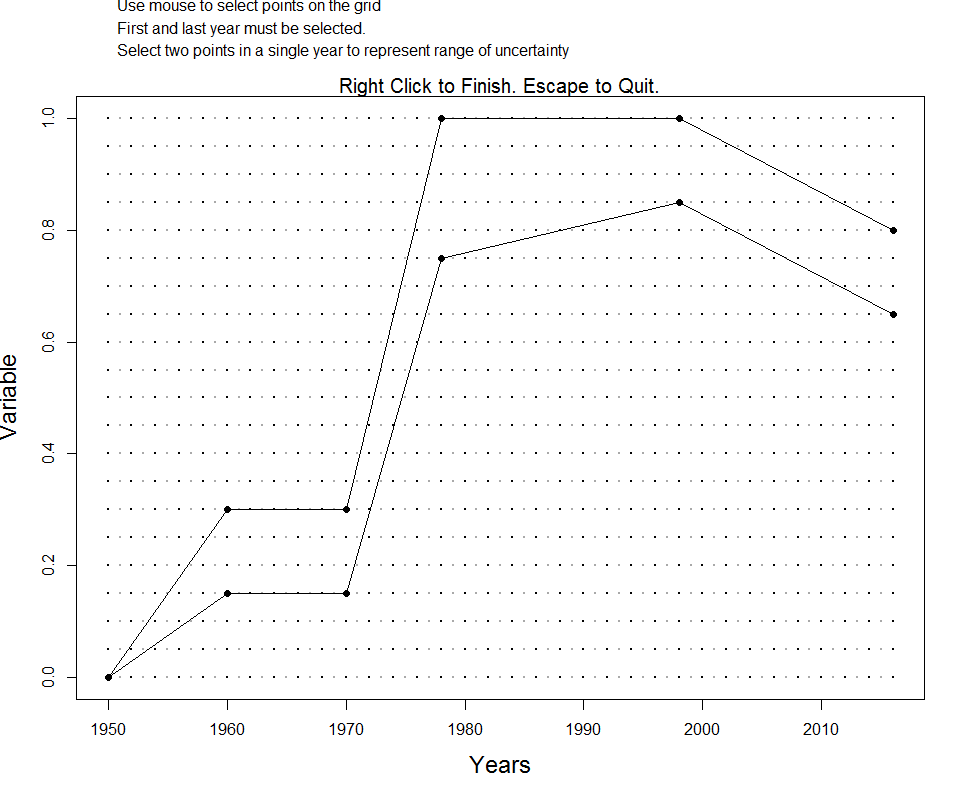

# (PART\*) Advanced DLMtool  {-}
```{r message=FALSE, warning=FALSE, include=FALSE}
setup()
```

# Averaging MPs
In some cases users may wish to provide management advice by averaging the recommendations from several different well-performing management procedures. This of course is a new management procedure in itself, and should be tested in MSE before being adopted for use in a fishery.

The `makeMeanMP` function can be used to create a new MP that averages the results of several MPs. 

For example, suppose we wished to develop an MP that averages the results of 4 output control MPs: `BK`, `DBSRA`, `Fadapt` and `Rcontrol`.

This can be achieved by the following:
```{r makeMeanMP}
avgMP <- makeMeanMP(c("BK", "DBSRA", "Fadapt", "Rcontrol"))
class(avgMP)
```

And now we can test our new MP in MSE. We will run a decent run of simulations so the results are stable:

```{r}
OM <- DLMtool::testOM
OM@nsim <- 200
MSE <- runMSE(OM, MPs=c("avgMP", "BK", "DBSRA", "Fadapt", "Rcontrol"), parallel = TRUE)
```

How did our newly created averaging MP perform? 

```{r}
Tplot(MSE)
```


More information on creating your own MPs can be found in the [Developing Custom Management Procedures] chapter.

# Evaluating OM 
The `Turing` function has been designed to evaluate an Operating Model against a Data object from the same fishery. The function generates 5 random samples of Data from the `OM` object and plots these together with the corresponding data in the `Data` object. 

Ideally, in a well conditioned OM one should not be able to visually detect which of the plots are the real data and which have been artifically generated by the operating model.

The `Turing` function takes an object of class `OM` and an object of class `Data`. It first plots the simulated and real data and then waits for user input before revelaing which of the plots are the real data from the `Data` object.  

We use the `wait=FALSE` argument here so that each plot is printed without waiting for user input. 

In this example we are using a `Data` object that was simulated using the same `OM`, so it shouldn't be suprising that it is difficult to detect which of the plots are from the `Data` object:

```{r Turing}
Turing(DLMtool::testOM, DLMtool::SimulatedData, wait=FALSE)
```

The `Turing` function is useful for evaluating if your OM adequately produces fishery data that appears similiar (e.g as variable) as your real observed data.

# Customizing the Operating Model

## Accounting for Historical Changes in Fishing
In some circumstances there may be knowledge on the changes in fishing practices over the years, and it would be good to include this information in the Operating Model.  

The Operating Model can be conditioned with respect to historical trends in the fishing mortality, historical changes in the selectivity pattern, and the existence of MPAs.

Remember to update and recompile the OM documentation whenever the OM is modified.

### Historical Trends in Fishing Mortality
Suppose that we know the fishery began in 1950, and fishing effort increased slowly over the next decade, was relatively stable between 1960 and 1970, then increased dramatically over the next 10 years.  We also know that, while fishing effort stayed relatively constant from 1980 to around 2000, there has been a general decline in fishing effort in recent years.

This information can be included in the Operating Model by using the `ChooseEffort` function.  The `ChooseEffort` function takes an existing Fleet object as its first argument, and allows the user to manually map out the range for the historical trend in fishing effort.  The `ChooseEffort` function then returns the updated Fleet object.  

A second optional argument can be used to specify the historical years. If used, this will replace the `nyears` in the Fleet object with the length of the `Years` vector.

```{r, eval=FALSE}
MyFleet <- ChooseEffort(MyFleet, Years=1950:2016)
```

<!-- ```{r, include=FALSE} -->
<!-- MyFleet@EffYears <- c(1950, 1960, 1970, 1978, 1998, 2016) -->
<!-- MyFleet@EffLower <- c(0, 0.15, 0.15, 0.75, 0.85, 0.65) -->
<!-- MyFleet@EffUpper <- c(0, 0.3, 0.3, 1, 1, 0.8) -->
<!-- ``` -->

```{r, echo=FALSE}

```

If we take a look at the `MyFleet` object, we will see that three slots `EffYears`, `EffLower` and `EffUpper` have been replaced with the new values.  

Note that the trajectory that is mapped out here represents the bounds on the relative fishing mortality for each year.  In this example, the fishing mortality rate was highest (on average) between 1980 and 2000, and is currently around 65 - 80% of this maximum level.  

### Historical Trends in Selectivity Pattern
Suppose that we may knew there had been changes in the selectivity pattern of the fishery over time. This information can be included in the Operating Model by using the `ChooseSelect` function.

Like the `ChooseEffort` function described above, the `ChooseSelection` function takes a Fleet object as it's first argument, and returns an updated Fleet object.

Suppose the selectivity pattern changed in 1970 and then again in 1990, perhaps because of changes in fishing regulations.  These change points in the selectivity curve can be mapped by the following command:
```{r, eval=FALSE}
MyFleet <- ChooseSelect(MyFleet, FstYr=1950, SelYears=c(1970, 1990))
```

```{r, echo=FALSE}
knitr::include_graphics("images/Select.png")
```

Note that the first year (`FstYr`) must also be specified, and the selectivity pattern is mapped for this year as well.

When `ChooseSelect` is used, the `L5Lower`, `L5Upper`, `LFSLower`, `LFSUpper`, `VmaxLower`, `VmaxUpper`, and `SelYears` slots are updated in the *Fleet* object.  If these slots are populated, the values in the `L5`, `LFS`, and `Vmaxlen` slots are ignored in the operating model.  


### Including Existing MPAs
By default the MSE assumes that there are no spatial closures in the historical period. Existing spatial closures can be accounted for with the `MPA` slot in the `Fleet` or `OM` object. 

To account for historical MPAs, the `MPA` slot should be a matrix with each row should containing a year index (e.g 10 for 10th historical year)
followed by fraction of area closed to fishing for each area. i.e. each row represents a change and the number of columns is `nareas` (default is 2) + 1. 

The spatial closures are assumed to remain in place for the future projections unless changed by a MP. Default (if left blank) is all areas are open to fishing in historical period.

For example:
```{r}
OM <- new("OM", Albacore, Generic_Fleet, Perfect_Info, Perfect_Imp)

## 50% of Area 1 was closed 30 years ago 
cl1 <- c(OM@nyears-30, 0.5, 1)
## 80% of Area 1 was closed 15 years ago
cl2 <- c(OM@nyears-15, 0.2, 1)
## 100% of Area 1 was closed last year
cl3 <- c(OM@nyears-1, 0, 1)

OM@MPA <- matrix(c(cl1, cl2, cl3), ncol=3, byrow=TRUE)
plotMPA(OM)

```

## Size-Specific Natural Mortality

### Constant M at age/size 
By default DLMtool assumes that natural mortality (*M*) is constant across age and size classes. However, in many species *M* is known to vary by size, and is often assumed to be higher for smaller age-classes and reduces as individuals age and grow. 

A number of users requested the option to include age or size-specific *M* and this has now been added to DLMtool.

There are a number of ways to specify age or size-specific *M* in DLMtool.

### Lorenzen function of weight
Natural mortality is often assumed to be a function of weight.  Size-specific *M* can be included in DLMtool following the approach of Lorenzen (1996):

$$M_w = M\left(\frac{W}{W_\infty}\right)^b$$
where $M_w$ is the natural mortality at weight $W$, $M$ is the natural mortality rate of adult fish, $W_\infty$ is the asymptotic weight, and $b$ is the allometric scaling factor (`Stock@Mexp`). Lorezen (1996) found that the exponent $b$ had an average value of -0.288, with 90% confidence intervals of -0.315 -- -0.261 for fish from natural systems. 

Because DLMtool uses an age-structured model, *M* is calculated as a function of age:

$$M_a = M\left(\frac{W_a}{W_\infty}\right)^b$$
where $M_a$ is natural mortality at age $a$ and $W_a$ is the mean weight at age $a$. *M*-at-age is then rescaled so that the mean *M* of adult age classes (mean age of maturity and greater) is equal to the natural mortality rate sampled from the stock object (`Stock@M`).


The `plotM` function can be used to visually inspect samples of the *M*-at-age, -length, and -weight that are generated by the model:

```{r}
Mackerel@Mexp <- c(-0.315, -0.261)
plotM(Mackerel)
```


### Map Age-Specific M
Usually the `M` slot contains two values, a lower and upper bound for the constant *M*-at-age. Users who wish for more control of *M*-at-age can use the `M` and `M2` slots in the `Stock` object to directly input values for *M*-at-age (`M` for lower bound and `M2` for upper bound). `maxage` values of *M* must be supplied for slots `M` and `M2`. One way to do this is to use the `ChooseM` function to map out the bounds for age-specific *M*:

```{r, eval=FALSE}
OM <- new("OM", Blue_shark, Generic_FlatE, Generic_Obs, Perfect_Imp)
OM <- ChooseM(OM)
```

```{r, echo=FALSE}
knitr::include_graphics("images/chooseM_age.png")
```

Click [here](images/chooseM_age.png) for a larger version of the image.

Alternatively, users can input the values directly into the `M` and `M2` slots (must be length `maxage`):

```{r setM2}
OM <- new("OM", Albacore, Generic_FlatE, Generic_Obs, Perfect_Imp)
OM@M <- c(0.7, 0.65, 0.60, 0.55, 0.61, 0.68, 0.75, 0.63, 0.51, 0.39, 0.27, 0.15, 0.15, 0.15, 0.15)
OM@M2 <- c(0.85, 0.8, 0.75, 0.7, 0.76, 0.83, 0.9, 0.78, 0.66, 0.54, 0.42, 0.3, 0.3, 0.3, 0.3)
```

The `plotM` function can then be used to visually display samples of the resulting *M* at age and size:

```{r plotM1}
plotM(OM)
```

### Map Length-Specific M
There is also the option to map length-specific *M* using the plotting tool:

```{r, eval=FALSE}
OM <- new("OM", Albacore, Generic_FlatE, Generic_Obs, Perfect_Imp)
OM <- ChooseM(OM, "length")
```


```{r, echo=FALSE}
knitr::include_graphics("images/chooseM_length.png")
```

Click [here](images/chooseM_length.png) for a larger version of the image.

```{r, include=FALSE}
OM <- new("OM", Albacore, Generic_FlatE, Generic_Obs, Perfect_Imp)
M_at_Length <- read.csv("CSVs/OMcparslength.csv")
OM@cpars$M_at_Length <- M_at_Length
```


This option uses the [Custom Parameters] feature of DLMtool:
```{r}
str(OM@cpars)
```

Again, samples of the resulting *M* at age and size can be plotted:
```{r}
plotM(OM)
```


## Selection, Retention and Discard Mortality

### Fishery Selection Curve
The fishery selection or vulnerability to the fishing gear in DLMtool is modelled using a double-normal curve and the parameters in the `Fleet` object: `L5` - smallest length at 5% selection, `LFS` - smallest length at full selection, and `Vmaxlen` the vulnerability of the largest length class (defined as expected length at maximum age `Stock@maxage`).

Here we set up a Operating Model with dome-shaped selectivity and plot a sample of the selectivity-at-age and -length using the `plotSelect` function:

```{r}
OM <- new("OM", Albacore, FlatE_Dom, Generic_Obs, Perfect_Imp, nsim=5)
plotSelect(OM, sim=1)
```

The plot shows three curves - vulnerability, realized selection and retention - in each panel. In this case they are all the same, because the default setting of DLMtool is to assume that all selected fish are retained in the catch. 

### Fishery Retention Curve
In some cases the fishing gear selects fish (often small sizes) that are not retained in the catch and are discarded at sea. The fishery-retention curve can be specified following the same approach as selectivity, using the following slots in the `Fleet` or `OM` object:

- `LR5` - the smallest length at 5% retention
- `LFR` - the smallest length at full selection
- `Rmaxlen` - the retention of the largest size class (defined as expected length at maximum age `Stock@maxage`).  

The default values for these parameters are:
```{r}
OM@LR5
OM@LFR
OM@Rmaxlen
```
meaning that the default assumption is that all size classes are fully retained by the fishery. 

The retention curve can be modified by providing values for these slots:

```{r}
OM@LR5 <- c(0.6, 0.7)
OM@LFR <- c(0.9, 1)
```

Note that the values in the `LR5` and `LFR` slots must be in the same units as those in the `L5` and `LFS` slots. Here we are specifying the values relative to the size of maturity, and assuming that the fishery discards the smaller sized fish:
```{r}
plotSelect(OM, sim=1)
```

The plot shows that the retention curve for the fishery has shifted to the right, towards larger and older fish, while the vulnerability of the fishing gear remains the same.

Because we are assuming no discard mortality in this case, the realized selection and retention curves are equivalent. This means that although fish of age/length between the vulnerability and retention curves are selected by the fishery, they are discarded with 100% survival and therefore are not removed from the population.

### Discard Mortality 
The assumption of 100% survival of discarded fish may be unrealistic in many situations. Discard mortality can be specified by the `Fdisc` slot in the `Stock` or `OM` object. The `Fdisc` slot represents the fraction of discarded fish that die, or $1-\text{survival}$. Here we assume that between 30 and 50% of discarded fish suffer fishing mortality:

```{r}
OM@Fdisc <- c(0.3, 0.5)
plotSelect(OM, sim=1)
```

We can see now that the realized selection and the retention curves are different for the age/size classes that are discarded by the fishery. The realized selection curve (dashed red line) represents the actual selectivity of the fish removed from the population. 

The retention curve (dotted blue line) shows the age/size classes that are retained by the fishery and appear in the total cathc, catch-at-age, and catch-at-length fishery data. 

The shaded gray area between these two curves represents that age/size classes that are caught and killed by the fishery but are discarded and do not appear in the catch statistics. 

The gear vulnerability curve remains unchanged, and shows that some individuals in the smaller age/size classes are caught and discarded alive back into the population.

### General Discarding
General discarding across all age or size classes can be included using the discarding rate slot `DR` in the `Fleet` or `OM` object. 

For example, here we assume that between 10 and 20% of all age/size classes are discarded by the fishery:

```{r}
OM@DR <- c(0.1, 0.2)
```
Plotting the selectivity and retention curves shows that a proportion of all age and size classes are now discarded, with the survival rate determined by the `Fdisc` parameter:

```{r}
plotSelect(OM, sim=1)
```

## Variable Management Interval
TO DO 


# Developing Custom Management Procedures
DLMtool was designed to be extensible in order to promote the development of new Management Procedures. In this chapter we design a series of new Management Procedures that include spatial controls and input controls in the form of size limit restrictions. 

If you wish, you can also add your newly developed MPs to the DLMtool package so they are accessible to other uses. Of course you will be credited as the author. Please [contact us](http://www.datalimitedtoolkit.org/contact) for details how to do this. 

As we saw before, real data are stored in a class of objects `Data`.

The DLMtool MSE function generates simulated data and puts it in exactly the same format as real data. This is highly desirable because
it means that the same MP code that is tested in the MSE can then be used to make management recommendations. 

If an MP is coded incorrectly it may catastrophically fail MSE testing and will therefore be excluded from use in management. 

## The Anatomy of an MP
Let's examine an existing output MP to identify the MP data requirements. 

```{r}
avail('Output')
```

Since we've seen it used as a default MP in lots of the examples above, lets learn more about DCAC

```{r, eval=FALSE}
?DCAC
```


We can even see all the code for this MP by simply typing the name of the MP into the console (this is a fantastic advantage of using R - there is complete transparency about package functions):

```{r}
DCAC
```

"Crikey that looks complicated!" might be your first reaction. However this output MP function is easily demystified.  

Like all MPs it has four arguments: `x`, `Data`, `reps` and `plot` (the last argument was added recently and is optional).

The argument `x` is the position in the Data object. When real data are stored in a Data object, there is only one position - there is only one real data set. 

However, in MSE we conduct many simulations and x refers to simulated data from simulation number `x`. Any single parameters such as natural mortality rate (`Mort`) are a vector (`nsim` long). See `Data@Mort[x]` in the DCAC code. Any time series such as annual catches or relative abundance indices, are a matrix of `nsim` rows and `nyears` columns.

A range of objects of class Data are available:

```{r}
avail('Data')
```

For simplicity lets use a Data object with just one simulation, `Simulation_1` and rename it `Data`

```{r}
Data <- Simulation_1
```

Since there is only one simulation in this data set (1 position) we can now see a single value of natural mortality rate:
```{r}
Data@Mort
```

And a matrix of catches with only 1 row:
```{r}
Data@Cat
```

We could generate a single TAC recommendation from these data using DCAC by specifying position 1 (there is only 1 simulation) and by setting reps=1 (we want a single DCAC TAC recommendation)

```{r}
DCAC(x=1,Data,reps=1)
```

If we wanted a stochastic estimate of the TAC we could increase the number of reps:

```{r}
hist(DCAC(x=1,Data,reps=1000)@TAC,xlab="TAC",ylab="Freq.",col="blue")
```

## A Constant Catch MP 
We've now got a better idea of the anatomy of an MP. It is a function that must accept three arguments (we will ignore `plot` for now):

* x: a simulation number 
* Data: an object of class `Data` 
* reps: the MP can provide a sample of TACs `reps` long. 

Let's have a go at designing our own custom MP that can work with DLMtool. We're going to develop an MP that sets the TAC as the '3rd highest catch'.

We decide to call our function `THC` 

```{r}
THC<-function(x, Data, reps){
  
  # Find the position of third highest catch
  
  THCpos<-order(Data@Cat[x,],decreasing=T)[3]
  
  # Make this the mean TAC recommendation
  
  THCmu<-Data@Cat[x,THCpos]
  
  # A sample of the THC is taken according to a fixed CV of 10%
  TACs <- THCmu * exp(rnorm(reps, -0.1^2/2, 0.1)) # this is a lognormal distribution

  Rec <- new("Rec") # create a 'Rec'object
  Rec@TAC <- TACs # assign the TACs to the TAC slot
  Rec # return the Rec object
}
```

To recap that's just seven lines of code: 

```{r}
THC<-function(x, Data, reps){
  THCpos<-order(Data@Cat[x,],decreasing=T)[3]
  THCmu<-Data@Cat[x,THCpos]
  Rec <- new("Rec")
  Rec@TAC <- THCmu * exp(rnorm(reps, -0.1^2/2, 0.1))
  Rec
}
```

We can quickly test our new MP for the example Data object
```{r}
THC(x=1,Data,reps=10)@TAC
```

Now that we know it works, to make the function compatible with the DLMtool package we have to assign it the class 'MP' so that DLMtool recognizes the function as a management procedure

```{r}
class(THC)<-"MP"
```

If we want to run the MSE in parallel we need to export the newly created function to the cluster:
```{r}
sfExport('THC')
```

## A More Complex MP
The THC MP is simple and frankly not a great performer (depending on depletion, life-history, adherence to TAC recommendations).

Let's innovate and create a brand new MP that could suit a catch-data-only stock like Indian Ocean Longtail tuna!

It may be possible to choose a single fleet and establish a catch rate that is 'reasonable' or 'fairly productive' relative to current catch rates. This could be for example, 40% of the 
highest catch rate observed for this fleet or, for example, 150% of current cpue levels.

It is straightforward to design an MP that will aim for this target index level by making adjustments to the TAC.

We will call this MP `TCPUE`, short for target catch per unit effort:

```{r}
TCPUE<-function(x,Data,reps){
  
  mc<-0.05                             # max change in TAC 
  frac<-0.3                            # target index is 30% of max
  nyears<-length(Data@Ind[x,])         # number of years of data
  
  smoothI<-smooth.spline(Data@Ind[x,]) # smoothed index  
  targetI<-max(smoothI$y)*frac         # target 
  
  currentI<-mean(Data@Ind[x,(nyears-2):nyears]) # current index
  
  ratio<-currentI/targetI              # ratio currentI/targetI
  
  if(ratio < (1 - mc)) ratio <- 1 - mc # if currentI < targetI
  if(ratio > (1 + mc)) ratio <- 1 + mc # if currentI > targetI
 
  Rec <- new("Rec")
  Rec@TAC <-  Data@MPrec[x] * ratio * exp(rnorm(reps, -Data@CV_Ind[x]^2/2, Data@CV_Ind[x]))
  Rec
}
```

The `TCPUE` function simply decreases the past TAC (stored in `Data@MPrec`) if the index is lower than the target and  increases the TAC if the index is higher than the target.

All that is left is to make it compatible with DLMtool:

```{r}
class(TCPUE)<-"MP"
sfExport("TCPUE")
```


## Beyond the Catch Limit
All management procedures return an object of class 'Rec' that contains 13 slots:

```{r}
slotNames("Rec")
```
We've already seen the TAC slot in the previous exercise. The remaining slots relate to various forms of input control:

* Effort (total allowable effort (TAE) relative to last historical year)
* Spatial - Fraction of each area that is open
* Allocate - Allocation of effort from closed areas to open areas
* LR5 - Length at 5% retention
* LFR - Length at 100% retention
* HS - Upper slot limit
* Rmaxlen - Retention of the maximum length class
* L5 - Length at 5% selection (e.g a change in gear type)
* LFS - Length at 100% selection (e.g a change in gear type)
* Vmaxlen - Selectivity of the maximum length class
* Fdisc - Update the discard mortality if required
* Misc - An optional slot for storing additional information

The `curE` MP just keeps effort constant at current levels:
```{r}
curE
```
Note that only the `Effort` slot in the `Rec` object is populated in this case.
     

To highlight the differences among Input control MPs examine spatial control MP `MRreal` that closes area 1 to fishing and reallocates  fishing to the open area 2:

```{r}
MRreal
```

In contrast `MRnoreal` does not reallocate fishing effort:

```{r}
MRnoreal
```

The MP `matlenlim` only specifies the parameters of length retention using an estimate of length at 50% maturity (`Stock@L50`):

```{r}
matlenlim
```

### An Example Effort Control
Here we will copy and modify the MP we developed earlier to specify a new version of the target catch per unit effort MP (`TCPUE`) that provides effort recommendations:

```{r}
TCPUE_e<-function(x,Data,reps){
  
  mc<-0.05                             # max change in TAC 
  frac<-0.3                            # target index is 30% of max
  nyears<-length(Data@Ind[x,])         # number of years of data
  
  smoothI<-smooth.spline(Data@Ind[x,]) # smoothed index  
  targetI<-max(smoothI$y)*frac         # target 
  
  currentI<-mean(Data@Ind[x,(nyears-2):nyears]) # current index
  
  ratio<-currentI/targetI              # ratio currentI/targetI
  
  if(ratio < (1 - mc)) ratio <- 1 - mc # if currentI < targetI
  if(ratio > (1 + mc)) ratio <- 1 + mc # if currentI > targetI
  
  rec <- new("Rec")
  rec@Effort <- Data@MPeff[x] * ratio
  rec
  
}
```

There have been surprisingly few changes to make TCPUE an input control MP that sets total allowable effort. 

1. We have had to use stored recommendations of effort in the `Data@MPeff` slot, and
2. The final line of the MP is our input control recommendatation that only modified the Effort.

That is all. 
Again, we need to assign our new function to class `MP` and export it to the cluster:

```{r}
class(TCPUE_e)<-"MP"
sfExport('TCPUE_e')
```

Let's test the two MPs and see how they peform:
```{r}
testMSE<-runMSE(testOM,MPs=c("TCPUE","TCPUE_e"), parallel = TRUE)
NOAA_plot(testMSE)
```


# Custom Parameters 
By default, DLMtool samples the operating model parameters from a uniform distribution. Because the parameters are sampled independently, it is not possible to generate correlated samples. However, the `cpars` slot in the `OM` object can be used to pass custom samples into the MSE.

The addition of the `cpars` slot provides a lot of flexibility to the DLMtool, and allows users full control of all parameters used in the model. For example, it is possible to generate operating models directly from the output of common stock assessment packages using functions in DLMtool (e.g `SS2DLM` for Stock Synthesis 3, and `iSCAM2DLM` for a iSCAM model - Note: these functions have now been moved to `MSEtool`). These functions take the correlated parameter values from the output of the stock assessment and provide them to DLMtool via the `cpars` slot, resulting in an operating model that is conditioned on the stock assessment. 

The `cpars` feature is being continually developed as more features are requested for DLMtool. 

## Valid cpars names
The `cpars` slot requires a named list containing the custom parameter values. You can see the valid names for `cpars` by typing:
```{r}
head(validcpars())
```

The custom parameters are divided into 5 different types: 'Stock', 'Fleet', 'Obs', and 'Imp' corresponding to the OM components of the same names, and 'internal' for internal operating model parameters that over-ride or ignore the values in the `OM` slots. 

A warning message will alert you if variables appear in the named `cpars` list that are not in `validcpars()`, and these will be ignored in the MSE.

## Correlated samples
As the `cpars` feature is used to provide correlated samples to the MSE, it is important that the same number of custom parameters are provided for each variable. In most cases, this is simply a vector `nsim` long. 

For example, if you wish to supply correlated samples of the von Bertalanffy growth parameters, you would create three vectors of length `nsim` containing the samples of Linf, K, and t0.

If the vectors are shorter than `nsim` they will simply be recycled. An error message will alert you if the vectors are not the same length. 

As a demonstration, we will use the `ForceCor` function to generate correlated samples of *M*, *K*, *L50*, and *Linf* and examine the `cpars` slot in the resulting OM object:

```{r}
OM <- ForceCor(DLMtool::testOM)
str(OM@cpars)

```

You can see that the `OM@cpars` slot is a list of length `r length(OM@cpars)` and contains named vectors with `r OM@nsim` correlated samples of the four parameters.  

Because the `OM@cpars` slot contains these values, the *M*, *K*, *L50*, and *Linf* values in the OM, e.g. `OM@M` will be ignored. 

Any additional custom parameters can be added to `cpars` using this same approach. For example, to provide custom (in this case uncorrelated) samples of *t0*:

```{r}
OM@cpars$t0 <- runif(OM@cpars, -1, 0)
str(OM@cpars)
```

## Custom internal parameters
It is also possible to supply custom generated time-varing values or other values to internal parameters using the `cpars` slot. For example, time-varying natural mortality or selectivity patterns. These are referred to as *internal* custom parameters. 

A list of valid internal cpars can be found by using the `validcpars` function. Here, for presentation purposes, we print just the first two columns:

```{r}
val_int <- validcpars('internal')
val_int[,c(1,2)]
```


We can see that there are `r nrow(val_int)` valid internal cpars. The internal cpars are parameters that are derived from one or more of the `OM` slots. 

For example, `M_ageArray` is an internal array that describes the natural mortality rate at age for each simulation and year. Typically, this array is derived from the `M`, `M2`, `Mexp`, `Mgrad` and `Msd` slots in the `Stock` object. Using the `cpars` feature we can override these values in the `OM` and provide our own values for *M* for each simulation, age, and year. 

Information on the `M_ageArray` variable in cpars can be found in the output of the `validcpars` function:
```{r}
val_int[15,]
```

To generate our own values of the M-at-age array we would populate `OM@cpars$M_ageArray` with an array with dimensions `OM@nsim`, `OM@maxage`, `OM@nyears+OM@proyears`.

The `cpars` feature is very powerful but also somewhat complicated, especially if you are using internal custom parameters. For example, by default DLMtool uses the  `OM@L50_95` slot (the increment between length at 50% maturity (`OM@L50`) and length at 95% maturity (`L95`)) to calculate the internal parameter `L95`. This is neccessary to ensure that `L95` is always greater than `L50`. Using internal parameters in `cpars` it is possible to pass values to `L95` directly, however now it is up to you to make sure that the `L95` values are greater than the corresponding `L50` values, otherwise you end up with a species where fraction mature decreases with age/size!  

```{r}
OM <- testOM 
OM@cpars$L95 <- rep(80, OM@nsim)
temp <- runMSE(OM, Hist=TRUE)

data.frame(L50=temp$SampPars$L50, L95=temp$SampPars$L95, diff=temp$SampPars$L95 - temp$SampPars$L50)

plot(1:OM@maxage, temp$AtAge$Mat_age[1,,1], type="l", 
     xlab="Age", ylab="Maturity")

```

We have tried to include checks to ensure the model is simulating credible population dynamics, but as this somewhat contrived example shows, care is needed when using `OM@cpars` to specify internal parameters. We recommend first running the model with `Hist=TRUE` as in the above example and examining the generated values to ensure the parameters you have added in `OM@cpars` are being used as expected. 

If you find that this is a feature you wish to use but are unclear how to do it, bug us with an email!


# Subsetting the MSE Object
The plotting functions demonstrated above calculate the probabilities and show the trade-offs for all the simulations in the MSE.  However, sometimes it is interesting to examine the results of individual Management Procedures or simulations.

Many of the plotting functions have the optional arguments `MPs` and `sims` which allow you to specify which particular Management Procedures or simulations to include in the plots. 

You can also manually subset the `MSE` object using the `Sub` function.

## Subsetting by Performance
For example, we may wish to include only Management Procedures that have greater than 70% probability that the biomass is above $0.5B_{MSY}$:

We can do this using a combination of the `summary` function and the `Sub` function:
```{r}
stats <- summary(BSharkMSE) # save summary object to `stats`
accept <- which(stats$P50 > 0.70) # index of methods that pass the criteria
MPs <- stats[accept,"MP"] # the acceptable MPs

subMSE <- Sub(BSharkMSE, MPs=MPs)
```

Here we can see that the `r MPs` methods (`r length(accept)` of the `r BSharkMSE@nMPs`) met our specified criteria. We used the `Sub` function to create a new `MSE` object that only includes these Management Procedures.   

We can than proceed to continue our analysis on the `subMSE` object, e.g.:
```{r}
Tplot(subMSE)
```

## Subsetting by Operating Model Parameters
We can also subset the `MSE` object by simulation.  For example, we may be interested to look at how the methods perform under different assumptions about the natural mortality rate (*M*).

In this MSE *M* ranged from `r round(range(BSharkMSE@OM$M)[1],2)` to `r round(range(BSharkMSE@OM$M)[2],2)`.  Here we identify the simulations where *M* was below and above the median rate:

```{r}
below <- BSharkMSE@OM$M < median(BSharkMSE@OM$M)
above <- BSharkMSE@OM$M > median(BSharkMSE@OM$M)
```

We can then use the `Sub` function to create two MSE objects, one only including simulations with lower values of *M*, and the other with simulations where *M* was above the median value:
```{r}
belowMSE <- Sub(BSharkMSE, sims=below)
aboveMSE <- Sub(BSharkMSE, sims=above)
```

You can see that the original MSE object has been split into two objects, each with half of the simulations:
```{r}
belowMSE@nsim
aboveMSE@nsim
```

We could then continue our analysis on each subset MSE and determine if the natural mortality rate is critical in determining which Management Procedure we would choose as the best option for managing the fishery.

# Custom Performance Metrics

`PM` methods were introduced in the [Performance Metrics Methods] chapter. DLMtool includes several built-in `PM` methods: 

```{r}
avail("PM")
```

We saw in [Customizing the `PM` Functions] that it is straightforward to modify the years that the performance statistics are calculated over using the `Yrs` argument, and the reference level using the `Ref` argument. In this section we describe the `PM` functions in more detail for advanced users who wish to develop their own `PM` methods.

We will demonstrate this using the `P50` performance metric function as an example.

## Necessity of Complexity

While at first glance the `PM` functions may appear overly complicated, they are actually quite straightforward. This level of complexity is required because functions of class `PM` not only return the required performance statistic, but also relevant contextual information. 

Imagine we want to develop a function to calculate the probability that $B > 0.5 B_\text{MSY}$, which we will define as *not overfished*. We could do something like this:

```{r}
P_Noverfished <- function(MSEobj) {
  round(apply(MSEobj@B_BMSY >0.5, 2, mean),2)
}
```

We could increase the flexibility of the function by adding additional arguments to specify the years to calculate the statistic over, but for this demonstration we will keep it simple. 

Applying our function to calculate the performance statistic is straightforward:

```{r}
MSEobj <- runMSE(silent=TRUE) # run an exampe MSE
p_noverfish <- P_Noverfished(MSEobj) # calculate and store our performance statistic
p_noverfish
```

The `p_noverfish` variable now contains our performance statistic, which we could use to plot or tabulate results. However, the numeric vector returned by `P_Noverfished` includes no information on what these numbers represent. This makes it difficult to include the results in generic plotting or summary functions. Furthermore, it is easy to imagine that with several similiar performance metric functions, it will be easy to loose track of the meaning of the results unless an elaborate variable naming system is used.

The `PM` functions have been designed to avoid this problem by returning all information related to the calculation of the performance statistic. Here we calculate the same performance metric using the relevant `PM` function:

```{r}
p1 <- P50(MSEobj)
```

Note that we don't need to use a descriptive variable name; the `p1` variable includes relevant information on the performance metric. Note also that `PM` function are most often passed directly to plotting or table functions instead of being called and stored directly.

The `p1` variable is an object of class `r as.character(class(p1))` and includes the following slots:
```{r}
slotNames(p1)
```

The first two slots contain a descriptive name of the performance statistic, and a caption that can be used in plots or summary tables: 
```{r}
p1@Name
p1@Caption
```

The last two slots contain the results of performance statistic and the names of the MPs:
```{r}
p1@Mean
p1@MPs
```

We will look at the other 3 slots in detail in the next section. The main point here is to demonstrate the using functions of class `PM` that return objects of class `PMobj` has the advantage that the function output is completely self-contained and can be used elsewhere without requiring any additional information.  


## `PM` Methods in Detail

Let's go through the `P50` function in detail to see how it works:

```{r}
P50
```

Firstly, functions of class `PM` must have three arguments: `MSEobj`, `Ref`, and `Yrs`:
```{r}
args(P50)
```

1. The first argument `MSEobj` is obvious, an object of class `MSE` to calculate the performance statistic. 
2. The second argument `Ref` must have a default value. This is used as reference for the performance statistic, and will be demonstrated shortly.
3. The third argument `Yrs` can have a default value of `NULL` or specify a numeric vector of length 2 with the first and last years to calculate the performance statistic, or a numeric vector of length 1 in which case if it is positive it is the first `Yrs` and if negative the last `Yrs` of the projection period. 


The first line of a `PM` function must be `Yrs <- ChkYrs(Yrs, MSEobj)`. This line updates the `Yrs` variable and makes sure that the specified year indices are valid. For example:

```{r, eval=FALSE}
ChkYrs(NULL, MSEobj) # returns all projection years 
ChkYrs(c(1,10), MSEobj) # returns first 10 years 
ChkYrs(c(60,80), MSEobj) # returns message and last 20 years
ChkYrs(5, MSEobj) # first 5 years
ChkYrs(-5, MSEobj) # last 5 years
ChkYrs(c(50,10), MSEobj) # returns an error
```

When the default value for `Yrs` is `NULL`, the `Yrs` variable is updated to include all projection years:

```{r}
Yrs <- ChkYrs(NULL, MSEobj)
Yrs
```

Next we create a new object of class `PMobj`, and populate the `Name` slot with a short but descriptive name:
```{r}
PMobj <- new("PMobj")
PMobj@Name <- "Spawning Biomass relative to SBMSY"
```

The next line populates the `Caption` slot with a brief caption including the years over which the performance statistic is calculated. The *if* statement is not crucial, but avoids the redundant `SB > 1 SBMSY` in cases where `Ref=1`. 

Next we store the value of the `Ref` argument in the `PMobj@Ref` slot so that information is contained in the function output.
```{r, eval=FALSE}
PMobj@Ref <- Ref
```

```{r, include=FALSE}
PMobj@Ref <- 0.5
```

The `Stat` slot is an array that stores the variable which we wish to calculate the performance statistic; an output from the `runMSE` function with dimensions `MSE@nsim`, `MSE@nMPs`, and `MSE@proyears` (or fewer if the argument `Yrs != NULL`). 

In this case we want to calculate a performance statistic related to the biomass relative to BMSY, and so we assign the `Stat` slot as follows:
```{r}
PMobj@Stat <- MSEobj@B_BMSY[, , Yrs[1]:Yrs[2]]
```

Note that we are including all simulations and MPs and indexing the years specified in `Yrs`. 

Next we use the `calcProb` function to calculate the mean of `PMobj@Stat > PMobj@Ref` over the years dimension. This results in a matrix with dimensions `MSE@nsim, MSE@nMPs`:

```{r}
PMobj@Prob <- calcProb(PMobj@Stat > PMobj@Ref)
```

Note that in order to calculate a probability the argument to the `calcProb` function must be a logical array, which is achieved using the `Ref` slot. 

Also note that in this case `PMobj@Stat > PMobj@Ref` is equivalent to `MSEobj@B_BMSY[, , Yrs[1]:Yrs[2]] > 0.5`. The `PM` functions have been designed this way so that in most cases the `PMobj@Prob <- calcProb(PMobj@Stat > PMobj@Ref)` line is identical in all `PM` functions and does not need to be modified. The exception to this is if we don't want to calculate a probability but want the actual mean values of `PMobj@Stat`, demonstrated in the example below.

In the next line we calculate the mean of `PMobj@Prob` over simulations using the `calcMean` function:

```{r}
PMobj@Mean <- calcMean(PMobj@Prob)
```

Similiar to the previous line, this line is identical in all `PM` functions and can be simply copy/pasted from other `PM` functions without being modified. The `Mean` slot is a numeric vector of length `MSEobj@nMPs` with the overall performance statistic, in this case the probability of $B > 0.5B_\text{MSY}$ across all simulations and years. 

Finally, we store the names of the MPs and return the `PMobj`. 


## Creating Example `PMs` and Plot
As an example, we will create another version of `DFO_plot` using some custom `PM` functions and a customized version of `TradePlot`.

First we create the plot using `DFO_plot`:
```{r}
DFO_plot(MSEobj)
```

From the help documentation (`?DFO_plot`) we can see that this function plots mean biomass relative to BMSY and fishing mortality rate relative to FMSY 
over the final 5 years of the projection. 

First we'll develop a `PM` function to calculate the mean B/BMSY for the last 5 years of the projection period. Notice that this is very similiar to `P50` described above, with the modification of the `Caption` and the `Prob` slots, and the `Yrs` argument. We are calculating a mean here instead of a probability and are not using the `Ref` argument:

```{r}
MeanB <- function(MSEobj = NULL, Ref = 1, Yrs = -5) {
    Yrs <- ChkYrs(Yrs, MSEobj)
    PMobj <- new("PMobj")
    PMobj@Name <- "Spawning Biomass relative to SBMSY"
    PMobj@Caption <- paste0("Mean SB/SBMSY (Years ", Yrs[1], " - ", Yrs[2], ")")
    
    PMobj@Ref <- Ref
    PMobj@Stat <- MSEobj@B_BMSY[, , Yrs[1]:Yrs[2]]
    PMobj@Prob <- calcProb(PMobj@Stat)
    PMobj@Mean <- calcMean(PMobj@Prob)
    PMobj@MPs <- MSEobj@MPs
    PMobj
}

```

We develop a `PM` function to calculate average F/FMSY in a similar way:

```{r}
MeanF <- function(MSEobj = NULL, Ref = 1, Yrs = -5) {
    Yrs <- ChkYrs(Yrs, MSEobj)
    PMobj <- new("PMobj")
    PMobj@Name <- "Fishing Mortality relative to FMSY"
    PMobj@Caption <- paste0("Mean F/FMSY (Years ", Yrs[1], " - ", Yrs[2], ")")
    
    PMobj@Ref <- Ref
    PMobj@Stat <- MSEobj@F_FMSY[, , Yrs[1]:Yrs[2]]
    PMobj@Prob <- calcProb(PMobj@Stat)
    PMobj@Mean <- calcMean(PMobj@Prob)
    PMobj@MPs <- MSEobj@MPs
    PMobj
}

```

Similar to developing custom MPs we need to tell R that these new functions are `PM` methods:

```{r}
class(MeanB) <- "PM"
class(MeanF) <- "PM"
```


Now we can test our performance metric functions:

```{r}
data.frame(MP=MeanB(MSEobj)@MPs, B_BMSY=MeanB(MSEobj)@Mean, F_FMSY=MeanF(MSEobj)@Mean)
```

How do these results compare to what is shown in `DFO_plot`?

We could also use the `summary` function with our new `PM` functions, but note that these results are not probabilities:

```{r}
summary(MSEobj, 'MeanB', 'MeanF')
```

Finally, we will develop a customized plotting function to reproduce the image produced by `DFO_plot`.

We can produced something fairly similar quite quickly using the `TradePlot` function:

```{r}
TradePlot(MSEobj, 'MeanB', 'MeanF', Lims=c(0,0))
```

Adding the shaded polygons and text requires a little more tweaking and some knowledge of the `ggplot2` package. We will wrap up our code in a function:

```{r}
NewPlot <- function(MSEobj) {
  # create but don't show the plot
  P <- TradePlot(MSEobj, 'MeanB', 'MeanF', Lims=c(0,0), Show=FALSE) 
  P1 <- P$Plots[[1]] # the ggplot objects are returned as a list
  
  # add the shaded regions and the text
  P1 + ggplot2::geom_rect(ggplot2::aes(xmin=c(0,0,0), xmax=c(0.4, 0.8, Inf), 
                                       ymin=c(0,0,1), ymax=rep(Inf,3)),
                          alpha=c(0.8, 0.6, 0.4), fill="grey86") +
    ggplot2::annotate(geom = "text", x = c(0.25, 0.6, 1.25), y = Inf, 
                      label = c("Critical", "Cautious", "Healthy") , 
                      color = c('white', 'darkgray', 'darkgray'), 
                      size=5, angle = 270, hjust=-0.25)

}

NewPlot(MSEobj)

```


