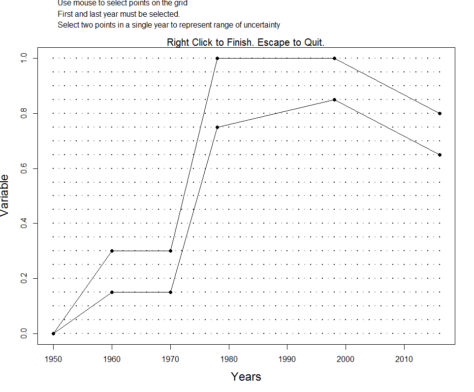

<!--chapter:end:index.Rmd-->


# (PART\*) Introduction {-}   

# Introduction 
As many as 90% of the world's fish populations have insufficient data to conduct a conventional stock assessment (Costello et al. 2012). Although a wide range of data-limited management procedures (MPs; stock assessments, harvest control rules) have been described in the primary and gray literature (Newman et al. 2015), they have not been readily available or easily tested to determine their efficacy for specific fisheries. 

For many fishery managers and stakeholders, the path forward has been unclear and laden with myriad questions, such as: How do these MPs perform comparatively? What are the performance trade-offs? What MPs are appropriate for a given fishery? What is the value of collecting additional data? What is an appropriate stop-gap management approach as more data are collected?

## Data-Limited Methods Toolkit  
The Data-Limited Methods Toolkit (DLMtool), a collaboration between the University of British Columbia's (UBC) Institute for Oceans and Fisheries and the Natural Resources Defense Council (NRDC), is aimed at addressing these questions by offering a powerful, transparent approach to comparing, selecting, and applying various data-limited management methods. DLMtool uses management strategy evaluation (MSE) and parallel computing to make powerful diagnostics accessible.

A streamlined command structure and operating model builder allow for rapid simulation testing and graphing of results. The package is relatively easy to use for those inexperienced in R, however, complete access and control is available to more experienced users.

```{r getMPs, include=FALSE, cache=TRUE}
library(DLMtool)
curVer <- packageVersion("DLMtool")
MPs <- avail("MP")
nMPs <- length(MPs)
```

While DLMtool includes over `r nMPs` management procedures it is also designed to be extensible in order to encourage the development and testing of new methods. The package is structured such that the same management methods that are tested by the MSE can be applied to provide management recommendations from real data.

Easy incorporation of real data is a central advantage of the software. A set of related functions automatically detect what management procedures can be applied with currently available data, and what additional data are needed to use currently unavailable methods.

The Toolkit has been developed in collaboration with fisheries scientists around the globe. New features and functions have been added to the software package to meet the needs or the particular fisheries and management contexts where it has been applied. To date, the Toolkit has been used for management or academic research in over 25 fisheries, including by the National Marine Fisheries Service in the U.S. Mid-Atlantic and Caribbean regions, and by the California Department of Fish & Wildlife.  

## Management Strategy Evaluation  
At the core of the Data-Limited Methods Toolkit is an integrated management strategy evaluation (MSE) function. Management strategy evaluation is a computer simulation approach for testing prospective management options over a wide range of possible realities for the fishery and the population. Ideally, management options can be identified that are robust and perform well over all credible scenarios for the fishery.

It is extremely difficult, perhaps impossible, to conduct large-scale experiments to evaluate directly the trade-offs associated with fisheries management. Even among well-studied fisheries, considerable uncertainty often exists regarding stock status and the dynamics of the fishery, and it can be difficult to attribute particular outcomes to distinct management actions. The mathematical description of fish population dynamics and the interaction with different exploitation patterns, first developed by Beverton and Holt (1957), together with the advent of powerful and affordable computers, has allowed the development of the MSE approach (Butterworth, 2007; Punt et al. 2014).

Management strategy evaluation was originally developed by the International Whaling Commission as a tool to evaluate the various trade-offs involved the management of marine mammals, and to guide the decision-making process for selecting an appropriate management strategy. Since its development in the mid-1970s, MSE has become widely used in fisheries science and is routinely applied to evaluate the trade-offs in alternative management strategies of many of the world's fisheries.

An MSE is usually comprised of three key components: 

1. an ***operating model*** that is used to simulate the stock and fleet dynamics, 
2. an assessment method and harvest control rule model (interchangeably referred to as ***management procedures***, or ***management strategies***) that use the simulated fishery data from the operating model to estimate the status of the (simulated) stock and provide management recommendations (e.g., a total allowable catch (TAC) or effort control), and 
3. an ***observation model*** that is used to generate the simulated observed data that would typically be used in management (i.e., with realistic imprecision and bias).  

The management recommendations by each management procedure are then fed-back into the operating model and projected forward one-time step. The process of simulating the population dynamics of the fishery along with the management process that feeds back and impacts the simulated fish population is known as ***closed-loop simulation***. 

A benefit of closed-loop simulation is that it allows the direct comparison and evaluation of alternative management strategies against perfect knowledge of the simulated system; something that is impossible in the real world (Walters and Martell, 2004). With the aid of computer simulation, it is possible to run many hundreds of simulation runs for each management procedure being evaluated - each representing a different possible simulated future of what could happen to the fishery under various management strategies - and to take into account the uncertainty in knowledge of the stock and fishery (i.e., errors in observation), as well as the uncertainty in future environmental and ecological conditions that are likely to affect the stock dynamics.

Through these simulations, MSE reveals the relative impacts of specified management approaches to their fishery decades into the future and enables managers to choose the approach that best achieves their management objectives, as articulated through a set of well-defined performance metrics.

## How does Management Strategy Evaluation Differ from Stock Assessment?  
Stock assessments are intended to provide one-off management advice, such as a catch limit (e.g. 20,000 tonnes), based on historical data. However, a stock assessment on its own provides no knowledge of the expected performance of the assessment, harvest control rule, or management system in general.

In an assessment setting there is no way to know whether a simpler assessment using other data might provide more robust performance (e.g. less overfishing, more yield) over a time horizon that managers are considering (e.g. the next 30 years).
Management strategy evaluation tests a range of management approaches (of which an assessment linked to a harvest control rule is one such approach) and offers a scientific basis for selecting a management approach. MSE does not provide a catch-limit in tonnes, it identifies a modus operandi that will provide the desired management performance (it is analogous to selecting a suitable airplane via flight simulation testing rather than actually flying a plane to a specific destination).

The advantage of MSE over stock assessment is that it is possible to consider a much wider range of uncertainty in stock dynamics, fleet dynamics, and data collection, which often better represents the state of knowledge (particularly for data-limited stocks). No matter how much uncertainty is factored into the MSE, a single management approach may be selected that can provide management advice.

MSE was specifically introduced in controversial fishery settings where it was not possible to decide the 'best' representation of the state of nature. In the end, MSE was used to circumvent this problem by including all possible states of nature, often revealing that the disputes were in fact inconsequential all along.

## Assumed Knowledge
This User Guide assumes that you are using RStudio with an up-to-date version of R and the latest version of the DLMtool installed.  

You can check your version of R by typing ```version``` into the R console:
```{r}
version
```

You can also find the version of DLMtool (or any other package) by typing:
```{r}
packageVersion('DLMtool')
```

The DLMtool package has been designed so that it is accessible for all users and does not assume a high level of knowledge of R.  The functions and User Guide have been constructed in such a way that a user with little experience with R should be able to run the MSE and apply the methods to their data.

No programming experience is required to use the package. However, users of the DLMtool should have some familiarity with R, and be comfortable with using the command line. The User Guide attempts to explain the use of the DLMtool in easy to follow steps, but familiarity with the most common R functions is assumed. 

The package is fully extensible, and more experienced R users are able to design their own management procedures, develop new plotting functions, and other customizations. 

## The User Manual
This user manual has been designed to introduce users to DLMtool and does not assume prior knowledge of DLMtool or extensive knowledge of R. Some familiarity with the concept of Management Strategy Evaluation and the commonly used parameters and data types is assumed. 

The user manual is continually being developed and we could use your help!

We've tried to design it from the perspective of someone who is brand new to DLMtool. But there are undoubtedly many ways in which it can be improve. Please [contact us](http://www.datalimitedtoolkit.org/contact) through our website or email us directly if you have any questions or suggestions for improvement.

Bug or typos can be reported on the userguide [GitHub](https://github.com/DLMtool/DLMtool_Userguide/issues/new) issues page. 

[Pull requests](https://github.com/DLMtool/DLMtool_Userguide/pulls) with edits are most welcome.


## DLMtool Bug Reports  
The package is subject to ongoing development and testing. If you find a bug or a problem please [contact us](http://www.datalimitedtoolkit.org/contact) or [report an issue on GitHub](https://github.com/DLMtool/DLMtool/issues/new) so that it can be fixed. If possible, please provide a minimal reproducible example so that we can recreate the problem and fit it.

## Version Notes  
The current version of the DLMtool package, available for download from [CRAN](https://CRAN.R-project.org/package=DLMtool), is `r curVer`.

Version notes for previous versions of DLMtool can be found at [DLMtool News](https://github.com/DLMtool/DLMtool/blob/master/NEWS.md)


<!--chapter:end:01-Introduction.Rmd-->


# (PART\*) Getting Started with DLMtool {-}

# Getting Started 


## Required Software
To get started with the DLMtool you will need at least two things:

 1. A current version of the R software installed on your machine.
 2. The latest version of the DLMtool package. 
 
### The R Software  
The R software can be freely downloaded from the [CRAN website](https://cran.r-project.org/) and is available for all operating systems.  Updated versions of R are released frequently, and it is recommended that you have the latest version installed. 

If you are using Windows OS, you can uses the ```installr``` package and the ```updateR()``` function to update and install the latest version.  Alternatively, head to the [CRAN website](https://cran.r-project.org/) to download the latest version of R. 


You can check your version of R by typing ```version``` into the R console:
```{r RVersion}
version
```


### RStudio  
[RStudio](https://www.rstudio.com/products/RStudio/) is a freely available integrated development environment (IDE) for R.  It is not essential that you use RStudio, but it can make things a lot easier, especially if you are new to R.  This User Guide assumes that you are using RStudio to operate the DLMtool.  

It is important to be aware that RStudio and R are two different pieces of software that must be installed separately.  We recommend installing the R software before downloading and installing RStudio. 


## Installing DLMtool
If this is the first time you are using DLMtool, you will need to install the DLMtool package from CRAN.

### Installing DLMtool using R Console  
This can be done by running the command:
```{r eval=FALSE}
install.packages("DLMtool")
```
A prompt may appear asking you to select a CRAN mirror. It is best to pick the mirror that is the closest geographical distance. 

### Installing DLMtool in RStudio  
An alternative method to install the DLMtool package is to click the *Packages* tab in the lower right panel in RStudio, and click *Install*.  Check that *Repository (CRAN, CRANextra)* is selected in the *Install from:* drop-down menu, type **DLMtool** into the *packages* dialog box, and click *Install*. 

The DLMtool package relies on a number of other R packages, which the installation process will automatically install.  The number of packages that are installed, and the time it takes, will depend on what packages you already have installed on your system (and your download speed).

```{r RStudioImage, echo=FALSE, out.width='50%'}
knitr::include_graphics("images/RStudioInstallPackage.png")
```

### Updating the DLMtool Package  
You will only need to install the DLMtool package once. However, the DLMtool package is updated from time to time, and you will need to re-install from CRAN for each new version. 

This can be done by using the `update.packages` command: 
```{r eval=FALSE}
update.packages("DLMtool")
```

### Checking DLMtool version

You can confirm the version of DLMtool by typing:
```{r PackageVersion}
packageVersion('DLMtool')
```


## Loading DLMtool

Once installed, the DLMtool package can be loaded into R by typing in the command line:
```{r LoadLibrary}
library(DLMtool)
```
or locating the *DLMtool* package in the list of packages in RStudio and checking the box.

You need to load the DLMtool package each time you start a new instance of R.

# A Very Quick Demo
Running an MSE with DLMtool is quite straightforward and only requires a single line of code:
```{r demoRun, cache=TRUE}
myMSE <- runMSE()
```

If you run this line (remember, if you haven't already you must first run `library(DLMtool)`) and see something similiar to the output shown here, then DLMtool is successfully working on your system! 

If the MSE did not run successfully, repeat the previous steps, ensuring that you have the latest version of R and the DLMtool package. If still no success, please [contact us](http://www.datalimitedtoolkit.org/contact) with a description of the problem and we will try to help.

Once an MSE is run, the results can be examined visually using plotting functions, for example:
```{r}
Pplot(myMSE)
```

Or quantified in various ways, for example:
```{r}
summary(myMSE)
```


# The Operating Model
The Operating Model (OM) is the main component of the MSE framework.  The OM is used to describe the characterstics of a fishery system and contains all the parameters required to simulate the population and fleet dynamics, the collection of data, and the application of a management procedure (e.g., implement a size regulation, effort control, spatial closure, or catch limit).

## OM Components
An OM is built from four separate components, each containing a set of parameter values for different aspects of the simulation:

1. Stock - parameters describing the stock dynamics
2. Fleet - parameters describing the fishing fleet dynamics
3. Obs (Observation) - parameters describing the observation processes (how the observed fishery data is generated from the simulated data)
4. Imp (Implementation) - parameters describing the management implemetation (how well the management regulations are implemented)

There are a number of example Stock, Fleet, Obs, and Imp parameter sets built into DLMtool which make it easy to quickly construct an OM and run an MSE. 

These parameter sets are referred to as *Objects* and have an associated *Class*. 

### Stock Object
The `avail` function can be used to examine the available Objects of a particular Class.

For example, to see the available objects of class *Stock*:
```{r avail_n, include=FALSE}
n <- length(avail('Stock'))
```
```{r avail}
avail('Stock')
```
This shows that there are `r n` objects of class *Stock*. We can confirm the class of this object by using the `class` function. For example, to examine the class of the object `Albacore`:
```{r}
class(Albacore)
```

As expected, the `Albacore` object is class *Stock*. 

Let's take a quick look at the contents of the Albacore Stock object:
```{r}
slotNames(Albacore)
```

```{r, include=FALSE}
Sslots <- slotNames(Albacore)
SnSlot <- length(Sslots)
```

The output tells us that there are `r SnSlot` slots in the `Albacore` Stock object.  Each of these slots contains information relating to stock that is used in the MSE.


We can examine the information that is stored in the slots using the @ symbol. For example, the name of the species in the Stock object is:
```{r}
Albacore@Name
```
The maximum age parameter is:
```{r}
Albacore@maxage 
```

The values for the natural mortality (*M*) parameter for this stock are:
```{r}
Albacore@M
```

Note that the natural mortality parameter (*M*) has two values, while the maximum age (*maxage*) only has one value.  

The MSE in the DLMtool is a stochastic model, and almost all parameters are drawn from a distribution.  By default this distribution is assumed to be uniform, and the two values for the *M* parameter represent the lower and upper bounds of this uniform distribution.

Some parameters, such as maximum age (*maxage*), species name (*Name*), or initial recruitment (*R0*) have only a single value and are fixed in the MSE.

You can see more information on the content of the *Stock* object by using the help function:
```{r, eval=FALSE}
class?Stock
```

### Fleet Object  
While the *Stock* object contains all the information relating to the fish stock that is being modeled, the *Fleet* object is populated with information relating to the fishing fleet and historical pattern of exploitation.

Like the *Stock* objects, there are a number of *Fleet* objects that are built into the DLMtoo:
```{r}
avail('Fleet')

```

Here we will look at the `Generic_Fleet` object.
```{r}
class(Generic_Fleet)
slotNames(Generic_Fleet)
```

```{r, include=FALSE}
Fslots <- slotNames(Generic_Fleet)
FnSlot <- length(Fslots)
```

There are `r FnSlot` slots in the *Fleet* object. The parameters in the *Fleet* object relate to the exploitation pattern of the stock.

For example, the number of years that the stock has been exploited is specified in the `nyears` slot:
```{r}
Generic_Fleet@nyears
```

As another example, the smallest length at full selection is specified in the `LFS` slot:
```{r}
Generic_Fleet@LFS
```

Note that by default the values in the `LFS` (and the `L5` [smallest length at 5% selectivity]) slots are specified as multiples of the length of maturity (e.g., `Albacore@L50`).  This is necessary because the *Fleet* objects built into the DLMtool are all generic, in the sense that they can be used with any *Stock* object.  

You will notice that the `isRel` slot in the `Generic_Fleet` object is set to "TRUE".  This means that the selectivity parameters are relative to the length of maturity in the *Stock* object.  Absolute values for the selectivity parameters can be used, for example by specifying `LFS` and `L5` to, say, 100 - 150 and 50 - 70 respectively. The `isRel` parameter must then be set to "FALSE", so that the Operating Model knows that these selectivity values are in absolute terms, and does not multiply them by the length of maturity (strange things may happen if the model assumes that the size of first capture is 50 to 70 times greater than the size of maturity!).

Note that all the parameters in the *Fleet* object have two values, representing the minimum and maximum bounds of a uniform distribution (with some exceptions that will be discussed in more detail later).

More information on the *Fleet* object can be found by typing:
```{r, eval=FALSE}
class?Fleet
```

### Obs Object  

The third component for the *Operating Model* is the *Obs* object.  This object contains all the information relating to how the fishery information is generated inside the model.

Why do we need a *Obs* object?

Although the MSE may be conditioned on real data and information about the fishery, all *data* is generated inside the model.  Because it is a simulation model and the data was generated by a computer, rather than some unobserved real world process, the *fishery data* is known perfectly. In the real world, however, all data sources and parameter estimates are subject to some observation error. The degree of uncertainty may vary between different data types, and between fisheries. 

The advantage of the MSE process is that the performance of a management procedure using the realistically noisy simulated data can be compared to the performance under conditions of perfect knowledge.  This comparison, which unfortunately is never possible in the real world, can reveal important information about the robustness (or sensitivity) of certain methods to variability and error in particular data types.  This knowledge can help to prioritize research to reduce uncertainty in the parameters and data sets that are most crucial to the performance of the method.  

Like the other two objects, there are a number of built-in *Obs* objects in the DLMtool.  

```{r}
avail('Obs')
```

Let's take a look at the `Imprecise_Unbiased` object:
```{r}
class(Imprecise_Unbiased)
slotNames(Imprecise_Unbiased)
```
```{r, include=FALSE}
Oslots <- slotNames(Imprecise_Unbiased)
OnSlot <- length(Oslots)
```

There are `r OnSlot` slots in *Obs* objects, each with information relating to the uncertainty of a data type.  

For example, the `LenMbiascv` slot defines the bias (coefficient of variability) in the length of maturity: 

```{r}
Imprecise_Biased@LenMbiascv
```

This means that the assumed length of maturity that is generated by the Operating Model, and used in the simulated application of a management procedure, is not the 'true' value set in the *Stock* object, but a value sampled with a `r paste0(Imprecise_Biased@LenMbiascv * 100, "%")` coefficient of variation. 


More information on the *Obs* object can be found by typing:
```{r, eval=FALSE}
class?Obs
```

### Imp Object  

The final component for the *Operating Model* is the *Imp* object.  This object contains all the information relating to how the management recommendation is actually implemented in the fishery, i.e., the implementation error. The `Imp` object includes slots for the over or under catch of TAC, implementation error in total allowable effort, and variability in size regulations. 

```{r}
avail('Imp')
class(Overages)
```

More information on the *Imp* object can be found by typing:
```{r, eval=FALSE}
class?Imp
```


## Building an OM from Component Objects
We will now look at how to combine objects of the four classes into an OM. For now we will work with the OM components that are built into DLMtool. In later sections of the user manual we will cover how to build your own Stock, Fleet, Obs, and Imp objects that characterises your fishery.  


Objects of class *Stock*, *Fleet*, *Obs* and *Imp* are used to create an Operating Model object (class `OM`). The simplest way to do this is to use `new` command. 

For example, here we are building a OM using the `Rockfish` Stock object, `Generic_Fleet` Fleet object, `Generic_Obs` Obs object, and `Perfect_Imp` Imp object and assigning it the name `myOM`:

```{r buildOM}
myOM <- new("OM", Rockfish, Generic_Fleet, Generic_Obs, Perfect_Imp)
```

What is the class of our newly created objects `myOM`? 

```{r classOM}
class(myOM)
```

If you use the `slotNames` function on the `myOM` object that was just created, you will see that it contains all of the information from the *Stock*, *Fleet*, *Obs*, and *Imp* objects:

```{r slotNames_OM}
slotNames(myOM)
```

You can access individual slots in the OM object using the @ symbol and confirm that these values are the same as those in the Stock object used to create the OM:
```{r}
Rockfish@M
myOM@M
```


In addition to the information from the Stock, Fleet, Obs, and Imp objects, the OM object also contains other values relating to the MSE, including the number of simulations to run (`nsim`), the number of projection years (`proyears`), and the management interval (`interval`):

```{r}
myOM@nsim 
myOM@proyears
myOM@interval
```

These slots all have default values that can be modified easily, for example:
```{r}
myOM@proyears <- 60
myOM@proyears
```


Remember, you can access the help information for objects by typing ? followed by the class name, for example:
```{r, eval=FALSE}
class?OM
```

In later chapters we will cover a range of methods to build new Stock, Fleet, Obs, and Imp objects and constructing OMs that characterise your fishery. 


## Visualizing an OM 
The newly created OM object `myOM` contains all the parameters that will be used to simulate our fishery, both the historical conditions and the future projections. The OM can visualized with the `plot` function (plots not shown here):
```{r plotOM_fun, eval=FALSE}
plot(myOM)
```


# Management Procedures
The purpose of an MSE is to compare the performance of alternative management approaches, or ***Management Procedures*** to identify the method that is most likely to meet the management objectives for the fishery.

## What is a Management Procedure?
In essence, a Management Procedure is simply a set of rules which define how a fishery will be managed.  These rules can range from simple harvest policies to more complex arrangements.  

For example, a simple Management Procedure may be a constant catch policy, where the annual total allowable catch (TAC) is set a some fixed value.  Alternatively, a more complex Management Procedure may involve multiple data sources, with rules that increase or reduce the TAC in response to trends in one or several indicators.

Management Procedures can differ in data requirements and complexity.  However, all Management Procedures have one thing in common.  They take fishery information and return a management recommendation.

To be included in an MSE, a Management Procedure must be reproducible and able to be coded in a set of instructions.  While fisheries are sometimes managed by expert judgment, it is difficult to reproduce the subjective decision-making process in a computer simulation and include such methods in an MSE.

## Available Management Procedure 
All management procedures in DLMtool are objects (actually functions in this case) of class `MP`. There are a number of MPs built into DLMtool. The `avail` function can be used to provide a list of MPs that can be included in the MSE:

```{r include=FALSE}
nMP <- length(avail('MP'))
```

```{r}
avail('MP')
```

As you can see, there are `r nMP` MPs built into the DLMtool.

DLMtool is extensible and it is relatively straightforward to develop your own MPs and include them in the MSE. This is covered in [Developing Custom Management Procedures]. 

## Types of Management Procedure 
In previous versions of DLMtool, the MPs were divided into two classes: Output controls which returned a total allowable catch (**TAC**) and Input controls which allow regulation of **fishing effort**, **size selecitivty**, or **spatial area**. 

Since DLMtool V5.1 it is possible to include MPs that provide a combination of input and output controls. 

All MPs in DLMtool are now class `MP`, but the MPs are divided into four types: **Input** which allow regulation offishing effort, size selectivity, or spatial area but not a TAC, **Output** which return only a TAC recommendation, **Mixed** which return a combination of one or several input controls *and* a TAC, and **Reference** which are MPs that have been designed to be used as reference management procedures (e.g `FMSYref` which uses perfect information of FMSY and abundance). 


The `MPtype` function can be used to display the type for a particular MP, for example:
```{r}
MPtype("DCAC")
```

Or for all available MPs:
```{r MPtype-all, cache=TRUE}
MPtype(avail('MP'))
```

You can access help documentation for the MPs in the usual fashion, for example:
```{r eval=FALSE}
?DCAC
```

### Input Control MPs
Input controls allow some combination of adjustments to **fishing effort**, **size selecitivty**, or **spatial area**.

The available input control MPs are:
```{r avail-input}
avail("Input")
```

Remember, to access help documentation:
```{r, eval=FALSE}
?matlenlim
```

More information on input control MPs can be found in [Beyond the Catch Limit].

### Output Control MPs 
The output control methods in the DLMtool provide a management recommendation in the form of a TAC.  Some output controls are stochastic, allowing for uncertainty in the data or input parameters, and return a distribution of recommended TACs.

Output control methods are very common in fisheries management, especially in regions which have a tradition of managing fisheries by regulating the total amount of catch.

The available output controls are:

```{r, avail-output}
avail('Output')
```

### Mixed MPs 
Mixed MPs return a combination of input and output controls. Currently there are only a few mixed MPs in DLMtool, and these were developed simply for demonstration purposes. They may not work very well! See [Developing Custom Management Procedures] for more information on developing your own mixed MPs. And please [share](http://www.datalimitedtoolkit.org/contact) them with us, we'd love to add them to DLMtool!

```{r, avail-mixed}
avail('Mixed')
```

### Reference MPs
The final type is the reference MPs. These MPs are not designed to be used in practice, but are useful for providing a reference for comparing for the performance of other MPs. For example, the `FMSYref` and `NFref` methods (fishing perfectedly at F[MSY] and no fishing at all) can be useful for framing realistic performance with respect to a set of management objectives.

The available reference MPs are:

```{r, avail-reference}
avail('Reference')
```


# Running the MSE 
We have now covered the two main components of the MSE: the Operating Model (OM) and the Management Procedures (MPs). To run a MSE we need to specify the OM and the set of MPs that we wish to test. 

Here we will create an OM from the built-in objects and choose 2 MPs of each type to test in our demonstration MSE.

## Specify an Operating Model
First, we will construct the OM using a different set of built-in Stock, Fleet, Obs, and Imp objects:
```{r}
myOM <- new("OM", Albacore, DecE_Dom, Imprecise_Unbiased, Overages)
```

## Choose the Management Procedures
Next, we'll select 8 MPs to test in our MSE:

```{r}
myMPs <- c('AvC', 'Itarget1', 
           'matlenlim', 'ITe10',
           'AvC_MLL', 'Itarget1_MPA',
           'FMSYref', 'NFref')

MPtype(myMPs)
```

## Run the MSE 
Now that we have specified an OM and chosen a set of management procedures we are ready to run the MSE:

```{r MSErun, cache=TRUE}
myMSE <- runMSE(OM=myOM, MPs=myMPs)
```


# Checking Convergence
It is important to ensure that we have included enough simulations in the MSE for the results to be stable. 

The `Converge` function can be used to confirm that the number of simulations is sufficient and the MSE model has converged, by which we mean that the relative position of the Management Procedures are stable with respect to different performance metrics and the performance statistics have stablized, i.e., they won't change significantly if the model was run with more simulations.

The purpose of the `Converge` function is to answer the question: have I run enough simulations?

By default the `Converge` function includes three commonly used performance metrics, and plots the performance statistics against the number of simulations. The convergence diagnostics are:

1. Does the order of the MPs change as more simulations are added? By default this is calculated over the last 20 simulations.
2. Is the average difference in the performance statistic over the last 20 simulations changing by more than 2%? 

The number of simulations to calculate the convergence statistics, the minimum change threshold, and the performance metrics to use can be specified as arguments to the function. See the help documentation for more details (`?Converge`).

```{r converge}
Converge(myMSE)
```

Have we run enough simulations?

The convergence plot reveals that both the order of the MPs and the performance statistics are not stable. This suggests that `r myOM@nsim` simulations is not enough to produce reliable results.

Let's increase the number of simulations and try again:

```{r}
myOM@nsim <- 200
```

```{r startTimer1, include=FALSE, cache=TRUE, warning=FALSE}
st <- Sys.time()
```

```{r MSErun2, cache=TRUE}
myMSE_200 <- runMSE(OM=myOM, MPs=myMPs)
```

```{r endstartTimer1, include=FALSE, cache=TRUE, warning=FALSE}
elapse1 <- Sys.time() - st
```

Is `r myOM@nsim` simulations enough?

```{r converge2}
Converge(myMSE_200)
```


# Plotting the MSE Results
The DLMtool has many built-in plotting functions which can be used to examine the performance of the Management Procedures. Advanced users can also develop their own plotting and summary functions. See the [Performance Metrics] chapter for more details.

Here we demonstrate a few of the plotting function. You can see a list of all the plotting functions in the DLMtool for `MSE` objects using the `plotFun` function:
```{r}
plotFun()
```

## Trade-Off Plots

The `Tplot` function creates four plots that show the trade-off between the expected relative yield and the probability of overfishing and the probability of the biomass being below three different reference points:
```{r}
Tplot(myMSE_200)
```


The `Tplot2` function shows the trade-off between long-term and short-term yield, and the trade-off between biomass being above $0.1B_{MSY}$ and the expected variability in the yield:
```{r}
Tplot2(myMSE_200)
```


The `NOAA_plot` function was developed from applications of the DLMtool to fisheries in the Caribbean. This plot shows the trade-offs between the probability of not overfishing and long-term yield, and the probability of not being in an overfished state versus the probability of the annual variation in yield being less than 15%:
```{r}
NOAA_plot(myMSE_200)
```

The `Tplot3` function has been designed to take a list of Performance Metrics objects, plot the performance metric against each other, and report if an MP has met the minimum conditions for all performance metrics:

```{r}
Tplot3(myMSE_200)
```

<!-- ## Joint Probability Plot -->
<!-- The previous plots calculate the probability of that Management Procedure will meet individual performance criteria.   -->

<!-- An alternative is to calculate the probability that a Management Procedure will simultaneously meet all of the performance criteria. The `Jplot` function has been designed to calculate and display the joint probability of meeting multiple criteria.   -->

<!-- For example, the plot below calculates the probability that the biomass in the last 10 years of the projection period is above $0.5B_{MSY}$ and $0.2B_0$ for each of the `r myMSE_200@nMPs` Management Procedures included in the MSE: -->

<!-- ```{r} -->
<!-- Jplot(myMSE_200) -->
<!-- ``` -->

<!-- The risk threshold and the performance criteria can be adjusted in the arguments to the `Jplot` function. -->


## Wormplot
The `wormplot` function plots the likelihood of meeting biomass targets in future years:
```{r}
wormplot(myMSE_200)
```

The arguments to the `wormplot` function allow you to choose the reference level for the biomass relative to $B_{MSY}$, as well as the upper and lower bounds of the colored bands.

## Projection Plots
The `Pplot` function plots the trajectories of biomass, fishing mortality, and relative yield for the Management Procedures.

By default, the `Pplot` function shows the individual trajectories of $B/B_{MSY}$ and $F/F_{MSY}$ for each simulation:
```{r, projection-plot, cache=TRUE}
Pplot(myMSE_200)
```

The `Pplot2` function has several additional arguments. The `YVar` argument can be used to specify additional variables of interest. For example, here we have included the projections of yield relative to the long-term optimum yield:
```{r, projection-plot2, cache=TRUE}
Pplot2(myMSE_200, YVar=c("B_BMSY", "F_FMSY", "Yield"))
```

The `traj` argument can be used to summarize the projections into quantiles. Here we show the 20th and 80th percentiles of the distributions (the median (50th percentile) is included by default):
```{r, projection-plot3, cache=TRUE}
Pplot2(myMSE_200, traj="quant", quants=c(0.2, 0.8))
```

Details on additional controls for the `Pplot` and `Pplot2` functions can be found in the help documentation associated with this function.

## Kobe Plots
Kobe plots are often used in stock assessment and MSE to examine the proportion of time the stock spends in different states.  A Kobe plot of the MSE results can be produced with the `Kplot` function:
```{r kobe-plot, cache=TRUE}
Kplot(myMSE_200)
```

## Compare to Current Conditions
The `Cplot` shows a scatter plot of the median biomass and median yield over the last five years of the projection relative to the current conditions (the last year in the historical period):

```{r}
Cplot(myMSE_200, ShowLabs=TRUE)
```

# Parallel Processing

Parallel processing increases the speed of running the MSE in DLMtool significantly. The use of parallel processing in DLMtool has changed slightly from previous versions of the package. 

By default the MSE runs without using parallel processing. We recommend running a few test runs of your MSE with a low number of simulations and without parallel processing. Once you are satisfied the model is running correctly for your operating model, you can increase the number of simulations and use parallel processing.

## Setting up Parallel Processing  
The `setup` function is used to set up parallel processing.
```{r setup, warning=FALSE}
setup()
```


By default the `setup` function initializes 4 processors as we have found this to be the most efficient for most systems. You can change the number of processors by specifying the `cpu` argument, e.g., `setup(cpu=6)`. 

See [Determining Optimal Number of Processors] for more details on calculating the optimal number of processors to use on your system. 

## Running MSE with Parallel Processing  
Use the `parallel=TRUE` argument in `runMSE` to use parallel processing. Note that you must run `setup()` first.

You will notice that the usual update messages are not printed to the console when parallel processing is used. This is why it is important to initially test your MSE with a small number of simulations without parallel processing. 

```{r startTimer2, include=FALSE, cache=TRUE}
st2 <- Sys.time()
```

```{r TestRun_parallel, cache=TRUE} 
myMSE_200P <- runMSE(myOM, parallel = TRUE)
```

```{r endTimer2, include=FALSE, cache=TRUE}
elapse2 <- Sys.time() - st2
```

Parallel processing can increase the speed of running the MSE considerably. For example, although in this demonstration we are only running a low number of simulations (`nsim=48`), run time decreased from `r round(elapse1,0)` to `r round(elapse2,0)` seconds when using parallel processing on 4 processors.


## Determining Optimal Number of Processors  
The `optCPU` function can be used to evaluate the relationship between number of processors and run time:

```{r optCPU, cache=TRUE, warning=FALSE}
optCPU()
```


<!--chapter:end:02-QuickStart.Rmd-->

# (PART\*) Creating an Operating Model  {-}

# Creating a New Operating Model

## An Example WorkFlow
The figure below shows our recommended workflow creating a new Operating Model (OM) in DLMtool.

```{r echo=FALSE, out.width = "600px"}
knitr::include_graphics("images/NewOMWorkflow.png")
```

## Create a New Project
We recommend creating a new directory for each OM. Each new R session should start by setting the working directory to this location. One of the easiest ways to do this is to create a new project in RStudio (File > New Project) and open this each time you revisit the analysis.

Alternatively, you can set the working directory with RStudio (Session > Set Working Directory) or directly in the R console, for example:

```{r , eval=FALSE}
setwd("C:/MSE/MyOM")
```


## Initialize a New OM
The `OMinit` function is used to create a blank OM spreadsheet and a skeleton OM documentation file in the working directory. 
This is only required the first time a new OM is created. 

The `OMinit` function requires one argument, a name for the OM, and wil create two files in the working directory. For example `OMinit('MyOM')` will create **MyOM.xlsx** and **MyOM.rmd** in the working directory.

**MyOM.xlsx** is a spreadsheet with sheets corresponding to the components of an OM: **Stock**, **Fleet**, **Obs**, and **Imp**, and **OM** worksheets. The first column in each sheet is populated with the names of the slots of the respective objects (Stock, Fleet, etc) and all slots are empty (except the OM sheet which has default values). 

The filled grey cells represent optional parameters - these are not required to run the MSE but may be used to further customized the OM (e.g age-dependant M). 

Values are required for all other parameters.

The **MyOM.rmd** file can be opened in any text editor or RStudio, and contains a skeleton for the OM documentation.  

The `OMinit` function also creates several folders in the working directory: data, docs, images, and robustness. These sub-directories can be used to store data, documents, images, and other information that is reference in the OM Report.

### Using Templates 

> **Note:** This feature requires additional software and may not be available on all systems. Specifically, it requires a zip application on the system PATH. Possibly the easiest way for this is to install [Rtools](https://cran.r-project.org/bin/windows/Rtools/) on your system. However, please note that this feature is not required to use DLMtool. 


Some users may wish to build an operating model based on other pre-existing OM, Stock, Fleet, Obs, or Imp objects. 

For example, `OMinit('Albacore2', Albacore)` will result in a **Albacore2.xlsx** file being created with the **Stock** sheet populated with the values from the **Albacore** Stock object. 

Other examples:
```{r, eval=FALSE}
OMinit('StockAndFleet', Albacore, Generic_FlatE) # using existing Stock and Fleet objects

OMinit('ObsAndImp', Generic_Obs, Perfect_Imp) # using existing Obs and Imp objects

OMinit('BorrowOM', OtherOM) # using an existing OM
```

### An Example
In this example we are going to create an OM called 'MyOM' using existing OM objects:

```{r, eval=FALSE}
OMinit('MyOM', Albacore, Generic_FlatE, Imprecise_Unbiased, Perfect_Imp)
```

We did this so that we can demonstrate the populated Excel and RMarkdown Files.


To create a blank OM called 'MyOM' you would simply write:
```{r, eval=FALSE}
OMinit('MyOM')
```


```{r, include=FALSE, cache=TRUE}
if (!dir.exists("ExampleOM")) dir.create("ExampleOM")
OMinit('MyOM', Albacore, Generic_FlatE, Imprecise_Unbiased, Perfect_Imp, dir='ExampleOM', overwrite = TRUE)
OMdoc(dir="ExampleOM", overwrite=TRUE, openFile=FALSE)
```


## Populate and Document OM
Next we open Excel workbook and populate the OM. 

Because we used templates our workbook is already populated. You can [download](docs/ExampleOM/MyOM.xlsx) and inspect the populated OM workbook we created in the previous step.

To assist in documenting the rationale for the OM parameters, we recommended adding a short but informative description or rationale for the OM values in the RMarkdown file while the OM Excel file is being populated (open the RMarkdown file and edit with any text editor or RStudio). 

Once complete, the RMarkdown file can be compiled into a HTML report and provides a complete documentation for the OM.  

The RMarkdown file we created earlier can be accessed [here](docs/ExampleOM/MyOM.rmd) and opened in RStudio. 

You will see that the RMarkdown file has a series of headings (marked by #, ##, and ### for first, second and third level respectively) followed by some text, in this case default text is mainly instructions on how to fill the document.

The instruction text should be deleted and replaced with the relevant information for your operating model. For example, below the line "# Introduction" you would delete the instructions and provide a brief introduction to your fishery and the purpose of the OM and MSE. 

It is important not to delete any of the headings.

After the Introduction section, the document has four first level headings corresponding to the Stock, Fleet, Obs and Imp components of the operating model. 

Each section has a series of second level headings (e.g., ## M) which correspond to the slots of that object. In this example, the text below these headings indicates that this parameter was borrowed from another object (e.g 'Borrowd from: Albacore'). 

If the parameters in the OM workbook are modified from those borrowed from the existing object (in this case 'Albacore'), you would delete this text and replace it will your own justification. 

If you did not initialize your OM using existing objects as templates, it will say something like 'No justification provided'. 

It is not neccessary to include the actual values in the justification text. The RMarkdown file containing the justifications/rationale will be compiled together with the OM Excel workbook containing the OM parameter values into a OM Report that contains both the justification text, the OM values, and a series of plots to visualize the OM parameters and properties.

The OM documentation file should be updated whenever values in the OM are changed.

## Compile the OM Report
Once the OM has been specified in the spreadsheet and documented in the RMarkdown file, it can be compiled into a OM Report using the `OMdoc` function. 

The `OMdoc` function 

```{r, eval=FALSE}
OMdoc('MyOM')
```

In most cases it is not neccessary to provide the name of the RMarkdown file to `OMdoc`. By default the `OMdoc` function will look for a file with the extension '.rmd' in working directory. For example, if the Excel file is named *MyOM* then `OMdoc` will look for *MyOM.rmd*, which is default name created by  `OMinit`.

Additionally, if there is only one *xlsx* file in the working directory the name of the OM is not required, i.e., `OMdoc()`.

The resulting [MyOM.html](docs/ExampleOM/MyOM.html) can opened in any web browser. Because we have not replaced any of the default text in the RMarkdown file, the resulting OM Report contains the same text. In your case, this default text should be replaced with information relevant to your OM.

It is also be possible to compile the OM report into a pdf using `OMdoc('MyOM', output="pdf_document")`, although this may require the installation of additional software on your system.


## Import the OM into R 
The OM can be imported from the Excel file using the `XL2OM` function. 

For example, to import the example OM created in the previous section:

```{r, eval=FALSE}
OM <- XL2OM('MyOM')
```

The OM is now ready to be used for analysis, for example:
```{r, eval=FALSE}
# Plot the OM
plot(OM) 

# Run an MSE using default MPs
MyMSE <- runMSE(OM)
```


## Documenting an Existing OM

To document existing OMs that don't use the Excel workbook the `OMinit` function can be used to create just the RMarkdown documentation file in the working directory.

The `OMdoc` function can be used to generate an OM report directly from an OM object and a RMarkdown file. In this case it is necessary to provide the name of the Rmarkdown file to `OMdoc`. 

For example, here we create an OM using existing objects from DLMtool, generate the RMarkdown documentation skeleton (only required once), and compile the OM report:

```{r, eval=FALSE}
BlueSharkOM <- new('OM', Blue_shark, Generic_Fleet, Imprecise_Biased, Perfect_Imp) 
OMinit('BlueSharkOM', files='rmd', BlueSharkOM)

# - Enter OM details in BlueSharkOM.rmd - 
OMdoc(BlueSharkOM, 'BlueSharkOM.rmd')
```

The same process is used if you are using the `cpars` feature to provide custom parameters to the MSE (see [Custom Parameters] section for more details).


# Operating Model Library
We are in the process of developing an online [library](http://www.datalimitedtoolkit.org/fishery_library) of DLMtool Operating Models. 

This library includes the OM Report, the OM Excel workbook, and the OM R Data file for many of the fisheries where DLMtool OMs have been built. The idea behind the OM library is to develop a resource for DLMtool users to learn from other applications as well as to provide OM templates which users can borrow and modify to suit their own fishery.

The OM library is still being developed and we are continuing to add OMs that we have constructed. If you have built a DLMtool OM and are happy to make it public, please [contact us](http://www.datalimitedtoolkit.org/contact/) through the website or email us directly, we would love to include it on our website.


<!--chapter:end:03-Creating-OMs.Rmd-->


# (PART\*) Interpreting MSE Results  {-}

# Examining the MSE object

In this chapter we will examine the MSE object in more detail. First we will run an MSE so that we have an MSE object to work with:

## Run an MSE
We create an OM based on the Blue Shark stock object and other built-in objects:
```{r}
OM <- new('OM', Blue_shark, Generic_Fleet, Imprecise_Biased, Perfect_Imp, nsim=200)
```

Note that we have increased the number of simulations from the default 48 to 200:
```{r}
OM@nsim
```

Let's choose an arbitrary set of MPs:
```{r}
MPs <- c("Fratio", "DCAC", "Fdem", "DD", "matlenlim") 
```

Set up parallel processing:
```{r, message=FALSE, warning=FALSE}
setup()
```

And run the MSE using parallel processing and save the output to an object called `BSharkMSE`:
```{r, cache=TRUE}
BSharkMSE <- runMSE(OM, MPs, parallel = TRUE)
```


## The MSE Object 
```{r, include=FALSE}
nslots <- length(slotNames(BSharkMSE))
nnames <- length(names(BSharkMSE@OM))
```
The names of the slots in an object of class `MSE` can be displayed using the `slotNames` function:
```{r}
slotNames(BSharkMSE)
```
As you can see, `MSE` objects contain all of the information from the MSE, stored in `r nslots` slots.

### The First Six Slots
The first six slots contain information on the structure of the MSE.  For example the first slot (`Name`),  is a combination of the names of the `Stock`, `Fleet`, and `Obs` objects that were used in the MSE:
```{r}
BSharkMSE@Name
```
Other information in these first slots includes the number of historical years (`nyears`), the number of projection years (`proyears`), the number of name of the Management Procedures (`nMPs` and `MPs`), and the number of simulations (`nsim`).

### The `OM` Slot
The `OM` slot in the `MSE` object is a data frame that the values of the parameters used in the Operating Model:
```{r}
names(BSharkMSE@OM)
```
If you use the `dim` function to report the dimensions of the `OM` data frame, you'll notice that there are `r nnames` columns, corresponding to the `r nnames` parameters in the Operating Model, and `r BSharkMSE@nsim` rows, each corresponding to a single simulation of the MSE.

### The `Obs` Slot
The `Obs` slot contains another data frame, this one with `r ncol(BSharkMSE@Obs)` columns corresponding to the values drawn from the Observation model:
```{r}
names(BSharkMSE@Obs)
```

The `Obs` data frame also has `r BSharkMSE@nsim` rows, each corresponding to a single simulation.  

The information contained in the `OM` and `Obs` slots can be used to examine the sensitivity of the performance of Management Procedures with respect to different operating model and observation parameters.  This is discussed in more detail below. 

### The `B_BMSY` and `F_FMSY` Slots
The `B_BMSY` and `F_FMSY` are data frames containing the biomass relative to biomass at maximum sustainable yield $\left(\frac{B}{B_{MSY}}\right)$, and fishing mortality relative to the rate corresponding to maximum sustainable yield $\left(\frac{F}{F_{MSY}}\right)$ for each simulation, Management Procedure and projection year.

If we look at the class of the `B_BMSY` slot, we see that it is an `array`:
```{r}
class(BSharkMSE@B_BMSY)
```

Using the `dim` function we can see that it is a 3-dimensional array, with the size corresponding to the number of simulations (`nsim`), the number of Management Procedures (`nMPs`), and the number of projection years (`proyears`): 
```{r}
dim(BSharkMSE@B_BMSY)
```

This information can be used to calculate statistics relating to the performance of each Management Procedure with respect to these metrics.

For example, if you wish to look at the distribution of $\frac{B}{B_{MSY}}$ for the second Management Procedure (`r BSharkMSE@MPs[2]`), you could use the `boxplot` function:
```{r}
boxplot(BSharkMSE@B_BMSY[,2,], xlab="Year", ylab="B/BMSY")
```

This plot shows that the relative biomass for the stock generally increases through the projection period when the `r BSharkMSE@MPs[2]` method is used, with the median relative biomass increasing from about `r round(median(BSharkMSE@B_BMSY[,2,1]),2)` in the first year to `r round(median(BSharkMSE@B_BMSY[,2,BSharkMSE@proyears]),2)` in the final year. 

However, the distribution appears to have quite high variability, which suggests that although the method works well on average, the final biomass was very low in some simulations.


### The `B`, `FM`, `C` and `TAC` Slots
The `B`, `FM`, and `C` slots contain the information relating to the stock biomass, the fishing mortality rate, and the catch for each simulation, Management Procedure, and projection year.

Typically, the MSE model in the DLMtool does not include information on the absolute scale of the stock biomass or recruitment, and all results usually must be interpreted in a relativistic context. 

This is particularly true for the biomass (`B`) and catch (`C`) where the absolute values in the MSE results (other than 0!) have little meaning.  

The biomass can by made relative to $B_{MSY}$, as shown above. Alternatively, biomass can be calculated with respect to the unfished biomass $\left(B_0\right)$, from information stored in the `OM` slot.

The catch information is usually made relative to the highest long-term yield (mean over last five years of projection) for each simulation obtained from a fixed *F* strategy.  This information (`RefY`) can be found in the `OM` slot.

Alternatively, the catch can be made relative to the catch in last historical year (`CB_hist`; see below), to see how future catches are expected to change relative to the current conditions.

The TAC slot contains the TAC recommendation for each simulation, MP, and projection year. In cases where a TAC was not set (e.g for a size limit), the value will be NA. The values in TAC may be different to those in the catch (C) slot due to implementation error of the total catch limit. 

### The `SSB_hist`, `CB_hist`, and `FM_hist` Slots
The `SSB_hist`, `CB_hist`, and `FM_hist` slots contain information on the spawning stock biomass, the catch biomass, and the fishing mortality from the historical period (the `nyears` in the operating model).  

These data frames differ from the previously discussed slots as they are 4-dimensional arrays, with dimensions corresponding to the simulation, the age classes, the historical year, and the spatial areas. 

The `apply` function can be used to aggregate these data over the age-classes or spatial areas.

### The `Effort` Slot
The `Effort` slot is a 3-dimensional array containing information on the relative fishing effort (relative to last historical year, or current conditions) for each simulation, Management Procedure and projection year.

We can look at the distribution of fishing effort for each Management Procedure in the final year of the projection period:

```{r}
pyear <- BSharkMSE@proyears
boxplot(BSharkMSE@Effort[,, pyear], outline=FALSE, 
        names=BSharkMSE@MPs, ylab="Relative fishing effort")

```
```{r, include=FALSE}
rng <- round(range(apply(BSharkMSE@Effort[,, pyear], 2, median)[1:4]),2)
```
This plot shows that the median fishing effort in the final year ranges from `r rng[1]` to `r rng[2]` for the first four output control methods, and is constant for the input control method (`matlenlim`).

This is because the output control method adjusts the total allowable catch, which depending on the amount of available stock, also impacts the amount of fishing activity.  

The input control methods assume that fishing effort is held at constant levels in the future, although the catchability is able to randomly or systematically vary between years.  Furthermore, input control methods can also adjust the amount of fishing effort in each year. 


# Performance Metrics 
A key use of the DLMtool is to evaluate the trade-offs in the performance of different potential Management Procedures and to assist in the decision-making process as to which Management Procedure is most likely to satisfy the various management objectives under realistic range of uncertainty and variability in the system.  

## The Need for Performance Metrics
In order to evaluate the relative effectiveness of different Management Procedures, it is important that decision-makers have clearly-defined management objectives.  These management objectives can be incorporated into the MSE process in the form of performance metrics, which provide the yardstick with which to compare the relative performance of different management strategies.  

Fisheries managers are confronted with the difficult task of maximizing yield and ensuring the sustainability of the resource and the overall health of the marine environment.  The principal objectives of fisheries management could be described as ensuring sustainable harvests and viable fishing communities, while maintaining healthy ecosystems.  However, this simplistic view overlooks the fact that there are often conflicts in different management objectives and that there is rarely an optimal management approach that fully satisfies all management objectives (Punt, 2015).  Walters and Martell (2004) explain that the task of modern fisheries management is to identify the various trade-offs among conflicting objectives and decide how to balance them in a satisfactory way.

## Inevitable Trade-Offs
A typical trade-off is the abundance of the target species versus the catch.  Assuming no significant system-wide natural perturbations, a fish stock may be exploited sustainability if catches are set at low levels.  However, such economic under-utilization of the resource is often seen as undesirable.  Alternatively, high catches may produce immediate short-term benefits, but may result in long-term degradation, or perhaps collapse, of the stock.  

Additionally, there is often a trade-off between stock size and fishing effort, which results in lower catch rates (and lower profit) for individual fishers when a large number of fishers are active in the fishery (Walters and Martell, 2004).  Other common trade-offs include the age and size at first capture, either delaying harvest until individuals are fewer in number (due to natural mortality) but larger in size, or capturing a large number of small sized fish (Punt, 2015).  

When multiple objectives are considered, there is usually not a single optimum solution, and fisheries managers are faced with the difficult task of determining the most appropriate management action that satisfies the numerous management objectives and stakeholder interests (Punt, 2015).

### Operational Management Objectives 
A key strength of the MSE approach is that decision-makers are required to specify clear objectives, which can be classified as either “conceptual” or “operational” (Punt et al., 2014).  Conceptual objectives are typically high-level policy goals that may be broadly defined.  

However, in order to be included in an MSE, conceptual objectives must be translated into operational objectives (i.e., expressed as values for performance metrics).  Such operational objectives, or performance metrics, may consist of both a reference point (e.g., biomass some fraction of equilibrium unfished level) as well as a measure of the acceptable associated risk (e.g., less than 10% chance that biomass declines below this reference level).

It is not unusual that some of the management objectives are in conflict.  A key benefit of the MSE approach is to highlight these trade-offs among the different management objectives to guide the decision-making process.  However, in order for these trade-offs to be quantified, it is critically important that the performance metrics are quantifiable and thus able to be incorporated into the MSE framework (Punt, 2015). 

## Performance Metrics in the DLMtool
Management strategy evaluation is a simulation exercise where the model can track the specific performance with perfect information, so it is possible to state performance objectives in specific terms that are consistent with the typical objectives of fisheries policies, such as: 

*	Biomass relative to unfished biomass $\left(B_0\right)$ or biomass at maximum sustainable yield $\left(B_{MSY}\right)$.
*	Fishing mortality rate relative to fishing at maximum sustainable yield $\left(F_{MSY}\right)$.
*	Yield (short-term or long-term) of a particular management strategy relative to the yield if the fishery were being exploited at $F_{MSY}$.
*	Inter-annual variability in yield or effort (e.g., fluctuations in yield from year to year).  

Because the management strategy evaluation runs many simulations of the fisheries performance under each management strategy being tested, the performance can be stated probabilistically, such as the specific probability of biomass being above or below a specific biomass threshold or target.  

### Fishing Mortality
For example, the management strategies can be ranked by the likelihood of overfishing to occur, where the probability of overfishing is measured by the proportion of simulation runs where the fishing mortality rate (*F*) under a specific management strategy is higher than the *F* that is expected to produce the maximum sustainable yield.  

Management strategies that have a lower probability of overfishing occurring are typically preferable to those that frequently cause excessive fishing mortality rates.  If there are 1,000 simulation runs for each management strategy over a 50-year projection period, then the probability of overfishing could be based on the proportion where *F* is greater than (or less than) $F_{MSY}$ over all years or any subset of years (e.g., probability of overfishing in years 41-50 of the 50-year projection period). 

### Stock Biomass
Another performance metric included in DLMtool is the probability that the stock biomass is above or below some biological reference point.  For example, a minimum performance limit may be half the biomass at maximum sustainable yield (0.5 BMSY), and the performance of the management strategies can be ranked by the probability of the stock remaining above this level.  

Management strategies that fail to maintain biomass above this limit with a high priority may be considered too risky and therefore excluded from further examination.  

### Developing Additional Performance Metrics
There may be other performance metrics that are of interest to fishery managers and stakeholders.  Stakeholder participation is critical when developing performance metrics to evaluate different biological scenarios or management strategies in a MSE.  Furthermore, it is important that the performance metrics, together with any acceptable risk thresholds are identified and agreed upon before the MSE is conducted.

The DLMtool can be customized to track and display additional performance metrics as identified by stakeholders.

### Summarizing Management Procedure Performance
The information in the `MSE` object can be summarized in a number of ways.

The `summary` function provides information on the performance of the Management Procedures with respect to various metrics, including the probability of overfishing, and the probability that the biomass is below various reference levels: 
```{r}
summary(BSharkMSE)
```

This information can be used to identify poorly performing methods, and exclude them from further, perhaps more comprehensive, runs of the MSE.

### Plotting MSE Results 
The performance of the MPs can also be examined visually. See the [Plotting the MSE Results] section for examples on DLMtool plotting functions for the MSE object. 

Advanced users may wish to develop their own plotting and summary functions. See the [Custom Performance Metrics] section for more details on this. 


# Value of Information
The Value of Information (VOI) functions have been designed to explore the sensitivity of the performance of the Management Procedures to variability in the observation processes and operating model parameters.

There are several VOI functions in DLMtool. 

The `VOI` function generates two plots, one corresponding to the operating model parameters, and the other to the observation model parameters, showing the gradient in long-term yield with respect to the individual parameters:
```{r, fig.height=9, fig.width=9}
VOI(BSharkMSE)
```

The `VOIplot` function shows something similar, but has an argument to specify either the Observation or Operating Model parameters:
```{r, fig.height=9, fig.width=9}
# Observation Parameters
VOIplot(BSharkMSE, nMP=5)

# OM Parameters
VOIplot(BSharkMSE, Par="OM", nMP=5)
```

By default, the `VOIplot` function only shows the four Management Procedures with the greatest sensitivity.  Here we've made it show all five methods using the `nMP` argument.

In this example we can see that the `Fratio` method is particularly sensitive to bias in the current estimate of abundance, and over-estimates of the current abundance result in very low long-term yield (probably do to collapse of the stock).  The DCAC method appears most sensitive to bias in the estimated catch.

We can also use the `VOIplot` function to look at the sensitivity with respect to the final biomass by specifying the `YVar` argument:
```{r, fig.height=9, fig.width=9}
VOIplot(BSharkMSE, Par="OM", nMP=5, YVar="B")
```

This result shows, perhaps unsurprisingly, that the final biomass is often strongly sensitive to the initial depletion, particularly for the DCAC and matlenlim methods.  


The `VOI2` function relates the operating model parameters and parameters of the observation model to relative yield (yield over last 5 years of projection relative to a 'best F' scenario that maximizes yield.

```{r, fig.height=9, fig.width=9}
VOI2(BSharkMSE)
```

`VOI2` assumes that relative cost for each type of improvement in data is linearly related to the number of samples (e.g. nCAAobs) or square function of improved precision and bias e.g.: relative $\text{cost}= \frac{1}{(\text{newCV}/\text{oldCV})^2}$

The VOI features of DLMtool are continuing to be developed and more VOI functions will be added soon. 


<!--chapter:end:04-Interpreting_MSE_Results.Rmd-->


# (PART\*) Using Fishery Data  {-}

# The Fishery Data Object (Data)

`Data` is an object class in the DLMtool that contains all of the fishery information that can be used by the Management Procedure.  You find the documentation for the `Data` class by typing:
```{r, eval=FALSE}
class?Data
```

You can see from the documentation that the `Data` object, or Fishery Data object, contains many slots, and a lot of information can be stored in this object, including biological parameters, fishery statistics such as time-series of catch, and past management recommendations.


## In the MSE
In the MSE the Fishery Data object is populated with data that is generated by the simulation model.  Here the 'true' data generated by the model is filtered through the Observation Model (using the Observation parameters) and entered into the Fishery Data object to represent typical fisheries data.

The MSE consists of many hundreds of simulations, and because the DLMtool has been designed for parallel processing, the Fishery Data object in the MSE actually consists of hundreds of 'versions' of the simulated fishery data. 

The first argument for all Management Procedure functions is `x`, which is the position in the `Data` object that refers to the data corresponding that particular iteration. In the MSE, the value of `x` goes from 1 to the total number of simulations (`nsim`).

The second argument for all Management Procedures in the DLMtool is the `Data` object.

For example, the arguments to the `AvC` MP are:
```{r}
args(AvC)
```

The [Developing Custom Management Procedures] section describes the arguments and internal workings of the Management Procedure functions in more detail. 

## Application of Management Procedures Using Real Fisheries Data 
In contrast to the MSE, in the real world application of a Management Procedure, we only have one version of the fishery data: the data that has been collected from the fishery. 

The Fishery Data object contains all of the fishery information that can be used by a Management Procedure.  By definition, many sources of data are not available in data-limited fisheries, and the Fishery Data object may not be completely populated.  The DLMtool can be used to determine which of the Management Procedures in the Toolkit are available to be used given the data in the Fishery Data object, which methods cannot be used, and what data are required to make these methods available.  


# Example Data Objects
The DLMtool package has a number of example Fishery Data objects. This can be listed using the `avail` function:
```{r}
avail("Data")
```

```{r, include=FALSE}
ndat <- length(avail("Data"))
```

# Creating Your Own Data Object
DLMtool has a series of functions to make importing data and applying data-limited Management Procedures relatively straightforward. 

There are two approaches: 

1. Fill out a .csv data file in excel or a text editor and use a DLMtool function to create a properly formatted `Data` object (class `Data`), or
2. Create a blank `Data` object and populate it in R. 

## Creating a Data File in Excel
```{r, include=FALSE}
if (!dir.exists("ExampleData")) dir.create("ExampleData")
DataInit("MyData", dir="ExampleData", overwrite = TRUE)
```

Probably the easiest way to get your data into the DLMtool is to populate a data table in an Excel workbook. 

You can create a Data workbook using the `DataInit` function, for example:
```{r, eval=FALSE}
DataInit("MyData")
```
This will create a file 'MyData.xlsx' in your current working directory, which can be populate with your fishery data.

Remember, to see the help documentation for information on the slots in the Data object:
```{r, eval=FALSE}
?class("Data")
```

You do not have to enter data for every line of the data file, if data are not available simply put an 'NA' next to any given field. 

## Importing the Data object
Once populated, the Excel Data file can be imported into R:
```{r, eval=FALSE}
MyData <- XL2Data('MyData')
```
In this case we get an error because the Data file is empty: we haven't populated it with an data yet. Luckily for us, DLMtool includes several example Data files.

## Example Fishery Data Files
```{r, include=FALSE}
file.copy(file.path(DLMDataDir(),"China_rockfish.csv"), "ExampleData")
```

One example Data file is the China rockfish. You can [download](docs/ExampleData/China_rockfish.csv) this Data file to your current working directory and import into R:

```{r, eval=FALSE}
China_rockfish <- XL2Data("China_rockfish.csv")
```

The CSV files for the other example Fishery Data objects are also included in the DLMtool package.  To find the location where these files are located on your machine, use the `DLMDataDir` function:
```{r}
DLMDataDir()
```

We can then load one of the example CSV files using the `XL2Data` function:

```{r}
China_rockfish2 <- XL2Data("China_rockfish.csv", dir=DLMDataDir())
```
or the `new` function:

```{r}
China_rockfish2 <- new("Data", file.path(DLMDataDir(),"China_rockfish.csv"))
```

Alternatively, you can navigate to the data directory (`DLMDataDir()`) on your machine and examine the contents and structure of the CSV data files in MS Excel or other software.

## Populating a Data Object in R
You can create a blank `Data` object and fill the slots directly in R. For example:

```{r}
Madeup <- new('Data')                             #  Create a blank DLM object
Madeup@Name <- 'Test'                                 #  Name it
Madeup@Cat <- matrix(20:11*rlnorm(10,0,0.2),nrow=1)   #  Generate fake catch data
Madeup@Units <- "Million metric tonnes"               #  State units of catch
Madeup@AvC <- mean(Madeup@Cat)                        #  Average catches for time t (DCAC)
Madeup@t <- ncol(Madeup@Cat)                          #  No. yrs for Av. catch (DCAC)
Madeup@Dt <- 0.5                                      #  Depletion over time t (DCAC)
Madeup@Dep <- 0.5                                     #  Depletion relative to unfished 
Madeup@vbK <- 0.2                                     #  VB maximum growth rate
Madeup@vbt0 <- (-0.5)                                 #  VB theoretical age at zero length
Madeup@vbLinf <- 200                                  #  VB maximum length
Madeup@Mort <- 0.1                                    #  Natural mortality rate
Madeup@Abun <- 200                                    #  Current abundance
Madeup@FMSY_M <- 0.75                                 #  Ratio of FMSY/M
Madeup@L50 <- 100                                     #  Length at 50% maturity
Madeup@L95 <- 120                                     #  Length at 95% maturity
Madeup@BMSY_B0 <- 0.35                                #  BMSY relative to unfished
```

# Plotting Data Objects
A generic summary function is available to visualize the data in a `Data` object:
```{r, fig.width=7, fig.height=3.5}
summary(Atlantic_mackerel)
```

This feature is currently being developed.


# Determining Which MPs Can Be Applied
You can see what Management Procedures can and can't be applied given your data and also what data are needed to get them working: 

The `Can` function generates a list of the MPs that are available to be applied to the Data object:
```{r Can}
Can(Atlantic_mackerel)
```

The `Cant` function displays a list of the MPs that cannot be applied to the Data object together with the reason why:
```{r Cant}
Cant(Atlantic_mackerel)
```

Finally, the `Needed` function displays the additional data slots that must be populated for the unavailable MPs to work:
```{r Needed}
Needed(Atlantic_mackerel)
````


# Applying Management Procedures

The `runMP` function can be used to apply a MP to a Data object. For example, to apply the `AvC` method:
```{r}
runMP(Atlantic_mackerel, "AvC", reps=1000)
```

The `runMP` prints out the MP recommendations to the console. In the case of a TAC, where multiple repititions where (see `reps` = 1000 above) used the `runMP` function prints the median TAC recommendation.

Although it only displays a summary, `runMP` invisibly returns the Data object with the TAC slot populated:

```{r}
Recs <- runMP(Atlantic_mackerel, "AvC")
hist(Recs@TAC)
```

`runMP` can be used to run several MPs:
```{r}
runMP(Atlantic_mackerel, c("AvC", "AvC_MLL"))
```

Or all available MPs:
```{r}
Atlantic_mackerel <- runMP(Atlantic_mackerel, reps=1000)
```

The TAC recommendations from each Output control can be plotted:

```{r, fig.height=7, fig.width=6}
boxplot(Atlantic_mackerel)
```


<!--chapter:end:05-Applying_MPs_to_data.Rmd-->


# (PART\*) Advanced DLMtool  {-}
```{r message=FALSE, warning=FALSE, include=FALSE}
setup()
```

# Customizing the Operating Model

## Accounting for Historical Changes in Fishing
In some circumstances there may be knowledge on the changes in fishing practices over the years, and it would be good to include this information in the Operating Model.  

The Operating Model can be conditioned with respect to historical trends in the fishing mortality, historical changes in the selectivity pattern, and the existence of MPAs.

Remember to update and recompile the OM documentation whenever the OM is modified.

### Historical Trends in Fishing Mortality
Suppose that we know the fishery began in 1950, and fishing effort increased slowly over the next decade, was relatively stable between 1960 and 1970, then increased dramatically over the next 10 years.  We also know that, while fishing effort stayed relatively constant from 1980 to around 2000, there has been a general decline in fishing effort in recent years.

This information can be included in the Operating Model by using the `ChooseEffort` function.  The `ChooseEffort` function takes an existing Fleet object as its first argument, and allows the user to manually map out the range for the historical trend in fishing effort.  The `ChooseEffort` function then returns the updated Fleet object.  

A second optional argument can be used to specify the historical years. If used, this will replace the `nyears` in the Fleet object with the length of the `Years` vector.

```{r, eval=FALSE}
MyFleet <- ChooseEffort(MyFleet, Years=1950:2016)
```

<!-- ```{r, include=FALSE} -->
<!-- MyFleet@EffYears <- c(1950, 1960, 1970, 1978, 1998, 2016) -->
<!-- MyFleet@EffLower <- c(0, 0.15, 0.15, 0.75, 0.85, 0.65) -->
<!-- MyFleet@EffUpper <- c(0, 0.3, 0.3, 1, 1, 0.8) -->
<!-- ``` -->

```{r, echo=FALSE}

```

If we take a look at the `MyFleet` object, we will see that three slots `EffYears`, `EffLower` and `EffUpper` have been replaced with the new values.  

Note that the trajectory that is mapped out here represents the bounds on the relative fishing mortality for each year.  In this example, the fishing mortality rate was highest (on average) between 1980 and 2000, and is currently around 65 - 80% of this maximum level.  

### Historical Trends in Selectivity Pattern
Suppose that we may knew there had been changes in the selectivity pattern of the fishery over time. This information can be included in the Operating Model by using the `ChooseSelect` function.

Like the `ChooseEffort` function described above, the `ChooseSelection` function takes a Fleet object as it's first argument, and returns an updated Fleet object.

Suppose the selectivity pattern changed in 1970 and then again in 1990, perhaps because of changes in fishing regulations.  These change points in the selectivity curve can be mapped by the following command:
```{r, eval=FALSE}
MyFleet <- ChooseSelect(MyFleet, FstYr=1950, SelYears=c(1970, 1990))
```

```{r, echo=FALSE}
knitr::include_graphics("images/Select.png")
```

Note that the first year (`FstYr`) must also be specified, and the selectivity pattern is mapped for this year as well.

When `ChooseSelect` is used, the `L5Lower`, `L5Upper`, `LFSLower`, `LFSUpper`, `VmaxLower`, `VmaxUpper`, and `SelYears` slots are updated in the *Fleet* object.  If these slots are populated, the values in the `L5`, `LFS`, and `Vmaxlen` slots are ignored in the operating model.  


### Including Existing MPAs
By default the MSE assumes that there are no spatial closures in the historical period. Existing spatial closures can be accounted for with the `MPA` slot in the `Fleet` or `OM` object. 

To account for historical MPAs, the `MPA` slot should be a matrix with each row should containing a year index (e.g 10 for 10th historical year)
followed by fraction of area closed to fishing for each area. i.e. each row represents a change and the number of columns is `nareas` (default is 2) + 1. 

The spatial closures are assumed to remain in place for the future projections unless changed by a MP. Default (if left blank) is all areas are open to fishing in historical period.

For example:
```{r}
OM <- new("OM", Albacore, Generic_Fleet, Perfect_Info, Perfect_Imp)

## 50% of Area 1 was closed 30 years ago 
cl1 <- c(OM@nyears-30, 0.5, 1)
## 80% of Area 1 was closed 15 years ago
cl2 <- c(OM@nyears-15, 0.2, 1)
## 100% of Area 1 was closed last year
cl3 <- c(OM@nyears-1, 0, 1)

OM@MPA <- matrix(c(cl1, cl2, cl3), ncol=3, byrow=TRUE)
plotMPA(OM)

```

## Size-Specific Natural Mortality

### Constant M at age/size 
By default DLMtool assumes that natural mortality (*M*) is constant across age and size classes. However, in many species *M* is known to vary by size, and is often assumed to be higher for smaller age-classes and reduces as individuals age and grow. 

A number of users requested the option to include age or size-specific *M* and this has now been added to DLMtool.

There are a number of ways to specify age or size-specific *M* in DLMtool.

### Lorenzen function of weight
Natural mortality is often assumed to be a function of weight.  Size-specific *M* can be included in DLMtool following the approach of Lorenzen (1996):

$$M_w = M\left(\frac{W}{W_\infty}\right)^b$$
where $M_w$ is the natural mortality at weight $W$, $M$ is the natural mortality rate of adult fish, $W_\infty$ is the asymptotic weight, and $b$ is the allometric scaling factor (`Stock@Mexp`). Lorezen (1996) found that the exponent $b$ had an average value of -0.288, with 90% confidence intervals of -0.315 -- -0.261 for fish from natural systems. 

Because DLMtool uses an age-structured model, *M* is calculated as a function of age:

$$M_a = M\left(\frac{W_a}{W_\infty}\right)^b$$
where $M_a$ is natural mortality at age $a$ and $W_a$ is the mean weight at age $a$. *M*-at-age is then rescaled so that the mean *M* of adult age classes (mean age of maturity and greater) is equal to the natural mortality rate sampled from the stock object (`Stock@M`).


The `plotM` function can be used to visually inspect samples of the *M*-at-age, -length, and -weight that are generated by the model:

```{r}
Mackerel@Mexp <- c(-0.315, -0.261)
plotM(Mackerel)
```


### Map Age-Specific M
Usually the `M` slot contains two values, a lower and upper bound for the constant *M*-at-age. Users who wish for more control of *M*-at-age can use the `M` and `M2` slots in the `Stock` object to directly input values for *M*-at-age (`M` for lower bound and `M2` for upper bound). `maxage` values of *M* must be supplied for slots `M` and `M2`. One way to do this is to use the `ChooseM` function to map out the bounds for age-specific *M*:

```{r, eval=FALSE}
OM <- new("OM", Blue_shark, Generic_FlatE, Generic_Obs, Perfect_Imp)
OM <- ChooseM(OM)
```

```{r, echo=FALSE}
knitr::include_graphics("images/chooseM_age.png")
```

Click [here](images/chooseM_age.png) for a larger version of the image.

Alternatively, users can input the values directly into the `M` and `M2` slots (must be length `maxage`):

```{r setM2}
OM <- new("OM", Albacore, Generic_FlatE, Generic_Obs, Perfect_Imp)
OM@M <- c(0.7, 0.65, 0.60, 0.55, 0.61, 0.68, 0.75, 0.63, 0.51, 0.39, 0.27, 0.15, 0.15, 0.15, 0.15)
OM@M2 <- c(0.85, 0.8, 0.75, 0.7, 0.76, 0.83, 0.9, 0.78, 0.66, 0.54, 0.42, 0.3, 0.3, 0.3, 0.3)
```

The `plotM` function can then be used to visually display samples of the resulting *M* at age and size:

```{r plotM1}
plotM(OM)
```

### Map Length-Specific M
There is also the option to map length-specific *M* using the plotting tool:

```{r, eval=FALSE}
OM <- new("OM", Albacore, Generic_FlatE, Generic_Obs, Perfect_Imp)
OM <- ChooseM(OM, "length")
```


```{r, echo=FALSE}
knitr::include_graphics("images/chooseM_length.png")
```

Click [here](images/chooseM_length.png) for a larger version of the image.

```{r, include=FALSE}
OM <- new("OM", Albacore, Generic_FlatE, Generic_Obs, Perfect_Imp)
M_at_Length <- read.csv("CSVs/OMcparslength.csv")
OM@cpars$M_at_Length <- M_at_Length
```


This option uses the [Custom Parameters] feature of DLMtool:
```{r}
str(OM@cpars)
```

Again, samples of the resulting *M* at age and size can be plotted:
```{r}
plotM(OM)
```


## Selection, Retention and Discard Mortality

### Fishery Selection Curve
The fishery selection or vulnerability to the fishing gear in DLMtool is modelled using a double-normal curve and the parameters in the `Fleet` object: `L5` - smallest length at 5% selection, `LFS` - smallest length at full selection, and `Vmaxlen` the vulnerability of the largest length class (defined as expected length at maximum age `Stock@maxage`).

Here we set up a Operating Model with dome-shaped selectivity and plot a sample of the selectivity-at-age and -length using the `plotSelect` function:

```{r}
OM <- new("OM", Albacore, FlatE_Dom, Generic_Obs, Perfect_Imp, nsim=5)
plotSelect(OM, sim=1)
```

The plot shows three curves - vulnerability, realized selection and retention - in each panel. In this case they are all the same, because the default setting of DLMtool is to assume that all selected fish are retained in the catch. 

### Fishery Retention Curve
In some cases the fishing gear selects fish (often small sizes) that are not retained in the catch and are discarded at sea. The fishery-retention curve can be specified following the same approach as selectivity, using the following slots in the `Fleet` or `OM` object:

- `LR5` - the smallest length at 5% retention
- `LFR` - the smallest length at full selection
- `Rmaxlen` - the retention of the largest size class (defined as expected length at maximum age `Stock@maxage`).  

The default values for these parameters are:
```{r}
OM@LR5
OM@LFR
OM@Rmaxlen
```
meaning that the default assumption is that all size classes are fully retained by the fishery. 

The retention curve can be modified by providing values for these slots:

```{r}
OM@LR5 <- c(0.6, 0.7)
OM@LFR <- c(0.9, 1)
```

Note that the values in the `LR5` and `LFR` slots must be in the same units as those in the `L5` and `LFS` slots. Here we are specifying the values relative to the size of maturity, and assuming that the fishery discards the smaller sized fish:
```{r}
plotSelect(OM, sim=1)
```

The plot shows that the retention curve for the fishery has shifted to the right, towards larger and older fish, while the vulnerability of the fishing gear remains the same.

Because we are assuming no discard mortality in this case, the realized selection and retention curves are equivalent. This means that although fish of age/length between the vulnerability and retention curves are selected by the fishery, they are discarded with 100% survival and therefore are not removed from the population.

### Discard Mortality 
The assumption of 100% survival of discarded fish may be unrealistic in many situations. Discard mortality can be specified by the `Fdisc` slot in the `Stock` or `OM` object. The `Fdisc` slot represents the fraction of discarded fish that die, or $1-\text{survival}$. Here we assume that between 30 and 50% of discarded fish suffer fishing mortality:

```{r}
OM@Fdisc <- c(0.3, 0.5)
plotSelect(OM, sim=1)
```

We can see now that the realized selection and the retention curves are different for the age/size classes that are discarded by the fishery. The realized selection curve (dashed red line) represents the actual selectivity of the fish removed from the population. 

The retention curve (dotted blue line) shows the age/size classes that are retained by the fishery and appear in the total cathc, catch-at-age, and catch-at-length fishery data. 

The shaded gray area between these two curves represents that age/size classes that are caught and killed by the fishery but are discarded and do not appear in the catch statistics. 

The gear vulnerability curve remains unchanged, and shows that some individuals in the smaller age/size classes are caught and discarded alive back into the population.

### General Discarding
General discarding across all age or size classes can be included using the discarding rate slot `DR` in the `Fleet` or `OM` object. 

For example, here we assume that between 10 and 20% of all age/size classes are discarded by the fishery:

```{r}
OM@DR <- c(0.1, 0.2)
```
Plotting the selectivity and retention curves shows that a proportion of all age and size classes are now discarded, with the survival rate determined by the `Fdisc` parameter:

```{r}
plotSelect(OM, sim=1)
```


# Developing Custom Management Procedures

DLMtool was designed to be extensible in order to promote the development of new Management Procedures. In this chapter we design a series of new Management Procedures that include spatial controls and input controls in the form of size limit restrictions. 

If you wish, you can also add your newly developed MPs to the DLMtool package so they are accessible to other uses. Of course you will be credited as the author. Please [contact us](http://www.datalimitedtoolkit.org/contact) for details how to do this. 

As we saw before, real data are stored in a class of objects `Data`.

The DLMtool MSE function generates simulated data and puts it in exactly the same format as real data. This is highly desirable because
it means that the same MP code that is tested in the MSE can then be used to make management recommendations. 

If an MP is coded incorrectly it may catastrophically fail MSE testing and will therefore be excluded from use in management. 

## The Anatomy of an MP
Let's examine an existing output MP to identify the MP data requirements. 

```{r}
avail('Output')
```

Since we've seen it used as a default MP in lots of the examples above, lets learn more about DCAC

```{r, eval=FALSE}
?DCAC
```


We can even see all the code for this MP by simply typing the name of the MP into the console (this is a fantastic advantage of using R - there is complete transparency about package functions):

```{r}
DCAC
```

"Crikey that looks complicated!" might be your first reaction. However this output MP function is easily demystified. 

Like all MPs it has three arguments: `x`, `Data` and `reps`.

The argument `x` is the position in the Data object. When real data are stored in a Data object, there is only one position - there is only one real data set. 

However, in MSE we conduct many simulations and x refers to simulated data from simulation number `x`. Any single parameters such as natural mortality rate (`Mort`) are a vector (`nsim` long). See `Data@Mort[x]` in the DCAC code. Any time series such as annual catches or relative abundance indices, are a matrix of `nsim` rows and `nyears` columns.

A range of objects of class Data are available:

```{r}
avail('Data')
```

For simplicity lets use a Data object with just one simulation, `Simulation_1` and rename it `Data`

```{r}
Data <- Simulation_1
```

Since there is only one simulation in this data set (1 position) we can now see a single value of natural mortality rate:
```{r}
Data@Mort
```

And a matrix of catches with only 1 row:
```{r}
Data@Cat
```

We could generate a single TAC recommendation from these data using DCAC by specifying position 1 (there is only 1 simulation) and by setting reps=1 (we want a single DCAC TAC recommendation)

```{r}
DCAC(x=1,Data,reps=1)
```

If we wanted a stochastic estimate of the TAC we could increase the number of reps:

```{r}
hist(DCAC(x=1,Data,reps=1000)@TAC,xlab="TAC",ylab="Freq.",col="blue")
```

## A Constant Catch MP 
We've now got a better idea of the anatomy of an MP. It is a function that must accept three arguments:

* x: a simulation number 
* Data: an object of class `Data` 
* reps: the MP can provide a sample of TACs `reps` long. 

Let's have a go at designing our own custom MP that can work with DLMtool. We're going to develop an MP that sets the TAC as the '3rd highest catch'.

We decide to call our function `THC` 

```{r}
THC<-function(x, Data, reps){
  
  # Find the position of third highest catch
  
  THCpos<-order(Data@Cat[x,],decreasing=T)[3]
  
  # Make this the mean TAC recommendation
  
  THCmu<-Data@Cat[x,THCpos]
  
  # A sample of the THC is taken according to a fixed CV of 10%
  TACs <- THCmu * exp(rnorm(reps, -0.1^2/2, 0.1)) # this is a lognormal distribution

  Rec <- new("Rec") # create a 'Rec'object
  Rec@TAC <- TACs # assign the TACs to the TAC slot
  Rec # return the Rec object
}
```

To recap that's just seven lines of code: 

```{r}
THC<-function(x, Data, reps){
  THCpos<-order(Data@Cat[x,],decreasing=T)[3]
  THCmu<-Data@Cat[x,THCpos]
  Rec <- new("Rec")
  Rec@TAC <- THCmu * exp(rnorm(reps, -0.1^2/2, 0.1))
  Rec
}
```

We can quickly test our new MP for the example Data object
```{r}
THC(x=1,Data,reps=10)@TAC
```

Now that we know it works, to make the function compatible with the DLMtool package we have to assign it the class 'MP' so that DLMtool recognizes the function as a management procedure

```{r}
class(THC)<-"MP"
```

If we want to run the MSE in parallel we need to export the newly created function to the cluster:
```{r}
sfExport('THC')
```

## A More Complex MP
The THC MP is simple and frankly not a great performer (depending on depletion, life-history, adherence to TAC recommendations).

Let's innovate and create a brand new MP that could suit a catch-data-only stock like Indian Ocean Longtail tuna!

It may be possible to choose a single fleet and establish a catch rate that is 'reasonable' or 'fairly productive' relative to current catch rates. This could be for example, 40% of the 
highest catch rate observed for this fleet or, for example, 150% of current cpue levels.

It is straightforward to design an MP that will aim for this target index level by making adjustments to the TAC.

We will call this MP `TCPUE`, short for target catch per unit effort:

```{r}
TCPUE<-function(x,Data,reps){
  
  mc<-0.05                             # max change in TAC 
  frac<-0.3                            # target index is 30% of max
  nyears<-length(Data@Ind[x,])         # number of years of data
  
  smoothI<-smooth.spline(Data@Ind[x,]) # smoothed index  
  targetI<-max(smoothI$y)*frac         # target 
  
  currentI<-mean(Data@Ind[x,(nyears-2):nyears]) # current index
  
  ratio<-currentI/targetI              # ratio currentI/targetI
  
  if(ratio < (1 - mc)) ratio <- 1 - mc # if currentI < targetI
  if(ratio > (1 + mc)) ratio <- 1 + mc # if currentI > targetI
 
  Rec <- new("Rec")
  Rec@TAC <-  Data@MPrec[x] * ratio * exp(rnorm(reps, -Data@CV_Ind[x]^2/2, Data@CV_Ind[x]))
  Rec
}
```

The TCPUE function simply decreases the past TAC (stored in `Data@MPrec`) if the index is lower than the target and  increases the TAC if the index is higher than the target.

All that is left is to make it compatible with DLMtool:

```{r}
class(TCPUE)<-"MP"
sfExport("TCPUE")
```


## Beyond the Catch Limit
All management procedures return an object of class 'Rec' that contains 13 slots:

```{r}
slotNames("Rec")
```
We've already seen the TAC slot in the previous exercise. The remaining slots relate to various forms of input control:

* Effort (total allowable effort (TAE) relative to last historical year)
* Spatial - Fraction of each area that is open
* Allocate - Allocation of effort from closed areas to open areas
* LR5 - Length at 5% retention
* LFR - Length at 100% retention
* HS - Upper slot limit
* Rmaxlen - Retention of the maximum length class
* L5 - Length at 5% selection (e.g a change in gear type)
* LFS - Length at 100% selection (e.g a change in gear type)
* Vmaxlen - Selectivity of the maximum length class
* Fdisc - Update the discard mortality if required
* Misc - An optional slot for storing additional information

The curE MP just keeps effort constant at current levels:
```{r}
curE
```
Note that only the `Effort` slot in the `Rec` object is populated in this case.
     

To highlight the differences among Input control MPs examine spatial control MP `MRreal` that closes area 1 to fishing and reallocates  fishing to the open area 2:

```{r}
MRreal
```

In contrast 'MRnoreal' does not reallocate fishing effort:

```{r}
MRnoreal
```

The MP `matlenlim` only specifies the parameters of length retention using an estimate of length at 50% maturity (`Stock@L50`):

```{r}
matlenlim
```

### An Example Effort Control
Here we will copy and modify the MP we developed earlier to specify a new version of the target catch per unit effort MP (`TCPUE`) that provides effort recommendations:

```{r}
TCPUE_e<-function(x,Data,reps){
  
  mc<-0.05                             # max change in TAC 
  frac<-0.3                            # target index is 30% of max
  nyears<-length(Data@Ind[x,])         # number of years of data
  
  smoothI<-smooth.spline(Data@Ind[x,]) # smoothed index  
  targetI<-max(smoothI$y)*frac         # target 
  
  currentI<-mean(Data@Ind[x,(nyears-2):nyears]) # current index
  
  ratio<-currentI/targetI              # ratio currentI/targetI
  
  if(ratio < (1 - mc)) ratio <- 1 - mc # if currentI < targetI
  if(ratio > (1 + mc)) ratio <- 1 + mc # if currentI > targetI
  
  rec <- new("Rec")
  rec@Effort <- Data@MPeff[x] * ratio
  rec
  
}
```

There have been surprisingly few changes to make TCPUE an input control MP that sets total allowable effort. 

1. We have had to use stored recommendations of effort in the `Data@MPeff` slot, and
2. The final line of the MP is our input control recommendatation that only modified the Effort.

That is all. 
Again, we need to assign our new function to class `MP` and export it to the cluster:

```{r}
class(TCPUE_e)<-"MP"
sfExport('TCPUE_e')
```

Let's test the two MPs and see how they peform:
```{r}
testMSE<-runMSE(testOM,MPs=c("TCPUE","TCPUE_e"), parallel = TRUE)
NOAA_plot(testMSE)
```


# Custom Parameters 
By default, DLMtool samples the operating model parameters from a uniform distribution. Because the parameters are sampled independently, it is not possible to generate correlated samples. However, the `cpars` slot in the `OM` object can be used to pass custom samples into the MSE.

The addition of the `cpars` slot provides a lot of flexibility to the DLMtool, and allows users full control of all parameters used in the model. For example, it is possible to generate operating models directly from the output of common stock assessment packages using functions in DLMtool (e.g `SS2DLM` for Stock Synthesis 3, and `iSCAM2DLM` for a iSCAM model). These functions take the correlated parameter values from the output of the stock assessment and provide them to DLMtool via the `cpars` slot, resulting in an operating model that is conditioned on the stock assessment. 

The `cpars` feature is being continually developed as more features are requested for DLMtool. 

## Valid cpars names
The `cpars` slot requires a named list containing the custom parameter values. You can see the valid names for `cpars` by typing:
```{r}
validcpars()
```

A warning message will alert you if variables appear in the named `cpars` list that are not in `validcpars()`, and these will be ignored in the MSE.

## Correlated samples
As the `cpars` function is used to provide correlated samples to the MSE, it is important that the same number of custom parameters are provided for each variable. In most cases, this is simply a vector `nsim` long. 

For example, if you wish to supply correlated samples of the von Bertalanffy growth parameters, you would create three vectors of length `nsim` containing the samples of Linf, K, and t0.

If the vectors are shorter than `nsim` they will simply be recycled. An error message will alert you if the vectors are not the same length. 

As a demonstration, we will use the `ForceCor` function to generate correlated samples of *M*, *K*, *L50*, and *Linf* and examine the `cpars` slot in the resulting OM object:

```{r}
OM <- ForceCor(DLMtool::testOM)
str(OM@cpars)

```

You can see that the `OM@cpars` slot is a list of length `r length(OM@cpars)` and contains named vectors with `r OM@nsim` correlated samples of the four parameters.  

Because the `OM@cpars` slot contains these values, the *M*, *K*, *L50*, and *Linf* values in the OM, e.g. `OM@M` will be ignored. 

Any additional custom parameters can be added to `cpars` using this same approach. For example, to provide custom (in this case uncorrelated) samples of *t0*:

```{r}
OM@cpars$t0 <- runif(OM@cpars, -1, 0)
str(OM@cpars)
```

## Custom time-varying parameters
It is also possible to supply custom generated time-varing values for some parameters using the `cpars` slot. For example, time-varying natural mortality or selectivity patterns.

Additional details on using the `cpars` slot for this will be added to the userguide soon. If you find that this is a feature you wish to use but are unclear how to do it, bug us with an email!


# Subsetting the MSE Object
The plotting functions demonstrated above calculate the probabilities and show the trade-offs for all the simulations in the MSE.  However, sometimes it is interesting to examine the results of individual Management Procedures or simulations.

Many of the plotting functions have the optional arguments `MPs` and `sims` which allow you to specify which particular Management Procedures or simulations to include in the plots. 

You can also manually subset the `MSE` object using the `Sub` function.

## Subsetting by Performance
For example, we may wish to include only Management Procedures that have greater than 70% probability that the biomass is above $0.5B_{MSY}$:

We can do this using a combination of the `summary` function and the `Sub` function:
```{r}
stats <- summary(BSharkMSE) # save summary object to `stats`
accept <- which(stats$P50 > 0.70) # index of methods that pass the criteria
MPs <- stats[accept,"MP"] # the acceptable MPs

subMSE <- Sub(BSharkMSE, MPs=MPs)
```

Here we can see that the `r MPs` methods (`r length(accept)` of the `r BSharkMSE@nMPs`) met our specified criteria. We used the `Sub` function to create a new `MSE` object that only includes these Management Procedures.   

We can than proceed to continue our analysis on the `subMSE` object, e.g.:
```{r}
Tplot(subMSE)
```

## Subsetting by Operating Model Parameters
We can also subset the `MSE` object by simulation.  For example, we may be interested to look at how the methods perform under different assumptions about the natural mortality rate (*M*).

In this MSE *M* ranged from `r round(range(BSharkMSE@OM$M)[1],2)` to `r round(range(BSharkMSE@OM$M)[2],2)`.  Here we identify the simulations where *M* was below and above the median rate:

```{r}
below <- BSharkMSE@OM$M < median(BSharkMSE@OM$M)
above <- BSharkMSE@OM$M > median(BSharkMSE@OM$M)
```

We can then use the `Sub` function to create two MSE objects, one only including simulations with lower values of *M*, and the other with simulations where *M* was above the median value:
```{r}
belowMSE <- Sub(BSharkMSE, sims=below)
aboveMSE <- Sub(BSharkMSE, sims=above)
```

You can see that the original MSE object has been split into two objects, each with half of the simulations:
```{r}
belowMSE@nsim
aboveMSE@nsim
```

We could then continue our analysis on each subset MSE and determine if the natural mortality rate is critical in determining which Management Procedure we would choose as the best option for managing the fishery.

# Custom Performance Metrics 

## The PM Object

> This section is under development. More detail coming soon.
> Please bug us with emails if it is taking too long!

A newly developed feature of DLMtool is the `PM` (performance metric) object. There are several `PM` objects in DLMtool.
```{r}
avail("PM")
```

The help documentation for the `PM` objects is still under development:
```{r, eval=FALSE}
?P100
```
The `PM` objects are designed to be applied to an object of class `MSE`: 

```{r}
P100(BSharkMSE)
```

## Developing Custom PMs
Users can develop their own `PM` objects.

> This section is under development. More detail coming soon.
> Please bug us with emails if it is taking too long!


<!--chapter:end:06-Advanced-DLMtool.Rmd-->


# (APPENDIX) Appendix {-}

# Acknowledgements 
Thanks to the many people who have alerted us to issues or bugs, provided suggestions for improvements, or asked the tricky, but important, questions that have helped us continue to develop the DLMtool.  

This User Guide has been developed with the [bookdown](https://bookdown.org/) package.

***Developers:***

- Thomas Carruthers, University of British Columbia (UBC) Institute for the Oceans and Fisheries
- Adrian Hordyk, University of British Columbia (UBC) Institute for the Oceans and Fisheries

***Collaborators:***

-	Doug Butterworth, University of Cape Town
-	Campbell Davies, Commonwealth Scientific and Industrial Research Organisation (CSIRO)
-	Helena Geromont, University of Cape Town
-	William Harford, National Oceanic and Atmospheric Administration (NOAA)
-	Richard Hillary, Commonwealth Scientific and Industrial Research Organisation (CSIRO)
-	Quang Huynh, Virginia Institute of Marine Science (VIMS)
-	Laurie Kell, International Commission for the Conservation of Atlantic Tuna (ICCAT)
-	Toshihide Kitakado, University of Tokyo
-	Skyler Sagarese, University of Miami Rosenstiel School of Marine and Atmospheric Science (RSMAS)
- Liz Brooks, National Oceanic and Atmospheric Administration (NOAA)
- Robyn Forrest, Canadian Department of Fisheries and Oceans
- Chris Grandin, Canadian Department of Fisheries and Oceans
- California Department of Fish and Wildlife

***Funders:***

- David & Lucille Packard Foundation
-	Gordon & Betty Moore Foundation
-	Kingfisher Foundation
-	Natural Resources Defense Council
-	Resources Legacy Fund
- Fisheries and Oceans, Canada (DFO)
- United Nations Food & Agriculture Organization (FAO)

# References 

Beverton, R. J. H., & Holt, S. J. (1957). *On the dynamics of exploited fish populations*. Fishery Investigation Series 2, United Kingdom Ministry of Agriculture and Fisheries, (Vol. 19). Book, London, United Kingdom.

Butterworth, D. S. (2007). Why a management procedure approach? Some positives and negatives. *ICES Journal of Marine Science: Journal Du Conseil*, 64(1995), 613–617.

Costello, C., Ovando, D., Hilborn, R., Gaines, S. D., Deschenes, O., & Lester, S. E. (2012). Status and solutions for the world’s unassessed fisheries. *Science*, 338, 517–520. 

Lorenzen, K. (1996), The relationship between body weight and natural mortality in juvenile and adult fish: a comparison of natural ecosystems and aquaculture. Journal of Fish Biology, 49: 627–642

Newman, D., Berkson, J., & Suatoni, L. (2015). Current methods for setting catch limits for data-limited fish stocks in the United States. *Fisheries Research*, 164, 86–93. 

Punt, A. E. (2015). Strategic management decision-making in a complex world: quantifying, understanding, and using trade-offs. *ICES Journal of Marine Science*, (fsv193), 12. 

Punt, A. E., Butterworth, D. S., de Moor, C. L., De Oliveira, J. A. A., & Haddon, M. (2014). Management strategy evaluation: best practices. *Fish and Fisheries*.

Restrepo, V., Thompson, G. G., Mace, P., Gabriel, W., Low, L., MacCall, A., Methot, R.D., Powers, J.E., Taylor, B., Wade, P.R., & Witzig, J. (1998). Guidance on the use of precautionary approaches to implementing National Standard 1 of the Magnuson-Stevens Fishery Conservation and Management. NOAA Technical Memorandum.

Walters, C. J., & Martell, S. J. D. (2004). *Fisheries ecology and management*. Book, Princeton, USA: Princeton University Press.


# Getting Help

## First Time Working With R?
This section is designed for first-time users of the DLMtool, or users who may not have a lot of experience with R.

You should be able to skip this section if you are familiar with R and RStudio, installing new R packages, and entering R commands into the R console.

To get started with the DLMtool you will need at least two things:

 1. A current version of the R software installed on your machine.
 2. The latest version of the DLMtool package.  

### The R Software {-}
The R software can be freely downloaded from the [CRAN website](https://cran.r-project.org/) and is available for all operating systems.  Updated versions of R are released frequently, and it is recommended that you have the latest version installed. 

If you are using Windows OS, you can uses the ```installr``` package and the ```updateR()``` function to update and install the latest version.  Alternatively, head to the [CRAN website](https://cran.r-project.org/) to download the latest version of R. 

### RStudio  {-}
[RStudio](https://www.rstudio.com/products/RStudio/) is a freely available integrated development environment (IDE) for R.  It is not essential that you use RStudio, but it can make things a lot easier, especially if you are new to R.  This User Guide assumes that you are using RStudio to operate the DLMtool.  

It is important to be aware that RStudio and R are two different pieces of software that must be installed separately.  We recommend installing the R software before downloading and installing RStudio.  

## Installing the DLMtool Package {#loadDLM} 
If this is the first time you are using DLMtool, you will need to install the DLMtool package from CRAN. 

### Installing DLMtool Using R Console {-}
This can be done by running the command:
```{r eval=FALSE}
install.packages("DLMtool")
```
A prompt may appear asking you to select a CRAN mirror. It is best to pick the mirror that is the closest geographical distance. 

### Installing DLMtool Using RStudio {-}
An alternative method to install the DLMtool package is to click the *Packages* tab in the lower right panel in RStudio, and click *Install*.  Check that *Repository (CRAN, CRANextra)* is selected in the *Install from:* drop-down menu, type **DLMtool** into the *packages* dialog box, and click *Install*. 

The DLMtool package relies on a number of other R packages, which the installation process will automatically install.  The number of packages that are installed, and the time it takes, will depend on what packages you already have installed on your system (and your download speed).

```{r, include=FALSE}
knitr::include_graphics("images/RStudioInstallPackage.png")
```

### Updating the DLMtool Package {-}
You will only need to install the DLMtool package once. However, the DLMtool package is updated from time to time, and you will need to re-install from CRAN for each new version. 

This can be done by using the `update.packages` command: 
```{r eval=FALSE}
update.packages("DLMtool")
```

### Loading the DLMtool Package {-}
Once installed, the DLMtool package can be loaded into R by typing in the command line:
```{r}
library(DLMtool)
```
or locating the *DLMtool* package in the list of packages in RStudio and checking the box.


## A Brief Note on S4 Methods 
The core functions of DLMtool are *S4 Classes*. Many R users may not have worked with S4 methods before. 

R has three different object oriented (OO) systems, the most common of which is known as **S3**.   S3 is known as a generic-function OO, and is a casual system with no formal definition of classes.  **S4** works similar to S3, but is more formal and uses classes with a more rigid definition.  

It is not essential to understand the difference between S3 and S4, or why one is preferred over the other, to use the DLMtool.  The most important thing that you need to know how to access the information in S4 classes. 

If you have work with R in the past, you are probably familiar with using the **$** symbol to access elements in a data frame or list.  S4 classes contain a named list of **slots** which are analogous to a standard R list.  However, the slots in a S4 class differ in two important ways:

1. The type of content in each slot (e.g., character, numeric, matrix) is determined in the class definition, and cannot be changed.  In other words, you are not able to put content of class ```character``` into a slot that is expecting information of class ```numeric```.  This is what is meant by the S4 system being more strict than S3.   
2. The slots are accessed with the @ symbol.  This is essentially the same as the **$** symbol in S3 classes.  You will see examples of this throughout the User Guide.

The main thing to note here is that when you see the `@` symbol being used, it refers to some particular information (a *slot*) being accessed from a larger collection of data (the *object*).

For further information on the S3 and S4 systems see [Advanced R](http://adv-r.had.co.nz/).


## Additional Help on the DLMtool 
This User Guide aims to explain the workings of the DLMtool, and address the most common questions and issues associated with the package.

Additional help material for the DLMtool package and functions can be obtained in the usual way:

```{r, eval=FALSE}
help(DLMtool)
```

Documentation for each function can be obtained by typing a ? symbol followed by the function name. For example:
```{r, eval=FALSE}
?runMSE
```

Information on the DLMtool classes can be found by first typing ```class``` followed by the ? symbol and the class name.  For example:
```{r, eval=FALSE}
class?Data
```

You can access this user guide at any time from the R console:
```{r, eval=FALSE}
userguide()
```


## Questions on R-related Problems 
Although the User Guide attempts to address the most common issues, undoubtedly there will be times where you have problems with your R code.  R has a somewhat annoying habit of returning cryptic error messages, that are sometimes indecipherable, especially to those who are new to the software.

Most coding problems with the R language are the result of a missing parenthesis, an extra or missing comma or quotation mark, or some other minor typo that stops your code from running.  

There are a number of resources available on the Internet that are devoted to dealing with questions and problems with R programming. [StackOverflow](http://stackoverflow.com/questions/tagged/r) is great place to start searching for answers to your R-related problems. 

There is a high chance that in the past someone has posted the exact question that you are dealing with, and one or several kind souls have provided helpful solutions. If not, you can post your own question. But be aware, the StackOverflow community is made up entirely of people who volunteer their time to help others, and they sometimes have little patience for questions that don't demonstrate a proper search for already posted answers to the problem.


# Assumptions of DLMtool

Like all models, DLMtool is a simplication of reality. In order to approximate real fishery dynamics, DLMtool relies on a number of simplifying assumptions.

Some of these assumptions are common to many fishery science models (e.g., age-structured population dynamics) and are a central to the structure of DLMtool. Other assumptions are a result of the way DLMtool was designed and developed, and may represent limitations of DLMtool for applications to particular situations. It may be possible to deal with some of these assumptions by further development of DLMtool.

## Biology 
### Short-Lived Species {-}
Due to the problems with approximating fine-scale temporal dynamics with an annual model it is not advised to use the DLMtool for very short lived stocks (i.e., species with a longevity of 5 years or less).

Technically, you could just divide all temporal parameters by a subyear resolution, but the TAC would be set by sub year and the data would also be available at this fine-scale which is highly unlikely in a data-limited setting.

A MSE model with monthly or weekly time-steps for the population dynamics is required for short-lived species, and may be developed in the future.

### Density-Dependent Compensation {-}
DLMtool assumes that, with the exception of the stock-recruitment relationship, there is no density-dependent compensation in the population dynamics, and fish growth, maturity, and mortality does not change directly in response to changes in stock size.

### von Bertalanffy Growth {-}
Growth model in DLMtool is modelled using the von Bertalanffy growth curve. While this is the most commonly applied model to describe fish growth, it may not be the preferred growth model for some species. The consequences of assuming the von Bertalanffy growth model should be considered when using the DLMtool for species with alternative growth patterns. Since DLMtool V4.4 it is possible to use alternative length-at-age models by using `cpars`. See the [Custom Parameters] chapter for more information. 

### Natural Mortality Rate at Age {-}
By default DLMtool assumes that natural mortality (*M*) is constant with age and size. Since DLMtool V4.4 size or age-specific M can be specified. See the [Size-Specific Natural Mortality] chapter for more information.


## MSE Model Assumptions 

### Retention and Selectivity {-}
The OM has slots for both gear selectivity and retention by size. If the retention slots are not populated, it is assumed that retention = selectivity, that is, all fish that are captured by the gear are retained by the fishers. 

Most size-regulation MPs (e.g., `matlenlim`) change the retention pattern and leave the selectivity pattern unchanged. For example, if a size limited is regulated well above the current size of selection, fish smaller than the size limit are still caught by the gear but are discarded and may suffer some fishing mortality (Stock@Fdisc). 

MPs can be designed to modify gear selectivity instead of, or in addition to, the retention-at-size. 

### Non-Convergence of Management Procedure {-}
In some cases during the MSE Management Procedure may not be able to successfully calculate a management recommendation from the simulated data. For example, a catch-curve may used to estimate $Z$, and $F$ is calculated as $F=Z-M$. Because of process and observation error, it is possible that the estimated $F$ is negative, in which case the MP may fail to calculate a recommended catch limit. 

The Management Procedures have been designed to return `NA` if they fail to calculate a management recommendation for any reason. In this case, the management recommendations from the previous year are used in the simulation, e.g., $\text{TAC}_y = \text{TAC}_{y-1}$.


### Idealised Observation Models for Catch Composition Data {-}
Currently, DLMtool simulates catch-composition data from the true simulated catch composition data via a multinomial distribution and some effective sample size. This observation model may be unrealistically well-behaved and favour those approaches that use these data. We are considering adding a growth-type-group model to improve the realism of simulated length composition data.

### Two-Box Model {-}
DLMtool uses a two-box spatial model and assumes homogeneous fishing, and distribution of the fish stock. That is, growth and other life-history characteristics do not vary across the two spatial areas. Spatial targeting of the fishing fleet is currently being developed in the model.

### Ontogenetic Habitat Shifts {-}
Since the operating model simulates two areas, it is possible to prescribe a log-linear model that moves fish from one area to the other as they grow older. This could be used to simulate the ontogenetic shift of groupers from near shore waters to offshore reefs. Currently this feature is in development.

### Closed System {-}
DLMtool assumes that the population being modelled is in a closed system. There is no immigration or emigration, and a unit stock is assumed to be represented in the model and impacted by the management decisions. This assumption may be violated where the stock extends across management jurisdictions. Violations of this assumption may impact the interpretation of the MSE results, and these implications should be considered when applying DLMtool.

Although a unit stock is a central assumption of many modeling and assessment approaches, it may be possible to further develop DLMtool to account for stocks that cross management boundaries.


## Management Procedures 
### Harvest Control Rules Must be Integrated into Data-Limited MPs {-}
In this version of DLMtool, harvest control rules (e.g. the 40-10 rule) must be written into a data-limited MP. There is currently no ability to do a factorial comparison of say 4 harvest controls rules against 3 MPs (the user must describe all 12 combinations). The reason for this is that it would require further subclasses.

For example the 40-10 rule may be appropriate for the output of DBSRA but it would not be appropriate for some of the simple management procedures such as DynF that already incorporate throttling of TAC recommendations according to stock depletion.

## Data and Method Application
### Data Assumed to be Representative {-}
The MSE model accounts for observation error in the simulated fishery data. However, the application of management procedures for management advice assumes that the provided fishery data is representative of the fishery and is the best available information on the stock. Processing of fishery data should take place before entering the data into the fishery data tables, and assumptions of the management procedures should be carefully evaluated when applying methods using DLMtool.


# Changes


### Important changes - DLMtool V4.1 and greater {-}
DLMtool V4.1 introduced some important changes to the Operating Model object. The number of simulations (`nsim`) and the number of projection years (`proyears`) are now slots in the `OM` object, rather than arguments to `runMSE` (see [Management Strategy Evaluation]). This change was required to allow users to specify their own custom futures for parameters like *M*, growth, etc. The `OM` object also now has a new random seed slot in the operating model, which ensures that the MSE results are now exactly reproducible.

You can modify the number of simulations, the number of projection years, or the value of the random seed by modifiying the relevant slots in the `OM` object:

- `OM@nsim`
- `OM@proyears`
- `OM@seed`

### Important changes - DLMtool V4.5 and greater {-}
Since DLMtool V5.0 the following slots have been added to the OM object:

- `OM@interval`
- `OM@pstar`
- `OM@maxF`
- `OM@reps`

This was done so that an OM object is completely self-contained and includes all information used in the MSE. 


<!--chapter:end:99-Appendices.Rmd-->

